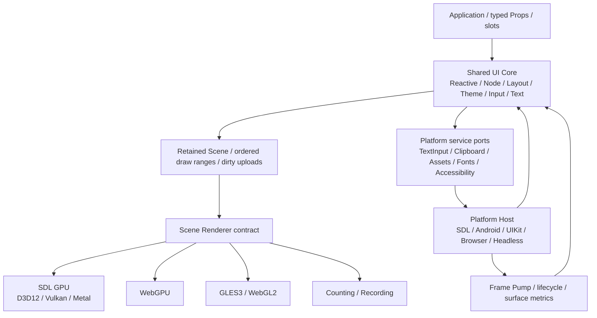

# RynUI 多 backend 与桌面、移动端、Web 可移植性调研

调研日期：2026-10-01；框架实施更新：2026-10-02。状态：**035 建立跨端框架基础，036 迁移 Quad/Glyph logical scene，037 继续隔离 Effect packing 与 Core 依赖；新 OS、浏览器/移动宿主与第二真实 GPU 后端仍未实现**。当前实际验收进度见 [037 tasks](../../openspec/changes/037-20261002-isolate-effect-packing-from-core/tasks.md)。

本文研究如何让同一套 RynUI C++ 组件与应用逻辑运行在 Windows、Linux、macOS、Android、iOS 和浏览器中。正式边界见 [架构](../architecture.md)与 [renderer 合同](../renderer-contract.md)，框架实施范围由 [035 change](../../openspec/changes/035-20261002-establish-portable-backend-foundation/tasks.md)与 [036 change](../../openspec/changes/036-20261002-retain-logical-scene-coordinates/tasks.md)确定；后续平台各自通过独立 change 明确兼容范围与验收。

初始研究基线为 `6991a133720a55c567368556b1626b2460c27eca`；035 实施基线为 `1640127`。Astra xhigh 复核研究、规划及实现，发现的问题与修复见 [审查记录](../../openspec/changes/035-20261002-establish-portable-backend-foundation/evidence/astra-review.md)。上游资料仍是调研日快照；上游支持某个平台与 RynUI 已经通过该平台验收是两件事。

## 1. 推荐方向

建议采用 **共享 UI Core + 可替换 Platform Host + 可替换 Scene Renderer**，保留细粒度响应式、retained Node、Constraints、Theme/Token 和专用 Primitive，不改变 typed Props/slots 的公开组件模型。

首选演进方案是：

1. 原生桌面继续使用 SDL3 平台层和 SDL GPU；逐步补齐 macOS 的 Metal 路径。
2. Android/iOS 先复用 SDL 宿主与现有场景渲染器，再按真实设备证据补充生命周期、软键盘、系统服务桥接。
3. Web 使用 Emscripten/Wasm 编译共享 C++ Core，浏览器宿主驱动事件和帧，新增 WebGPU Renderer。
4. 面向较广设备范围时，增加共享实现基础的 GLES3/WebGL2 Renderer：Android Vulkan 不可用时走 GLES3，浏览器 WebGPU 不可用时走 WebGL2。
5. Headless/Recording Renderer 用于真实数据合同测试；软件绘制是否成为产品兜底，另按目标设备决定。

**多 backend 的主要价值是让宿主、系统服务、GPU 实现分别替换，而不是重写一套组件库。** 本次优先改造框架，建立依赖边界、共同上传事务、真实 Recording 和非阻塞调度；第二真实 renderer 作为下一阶段 PoC，不要求本次交付新平台。

这里的“网页能用”首先指浏览器中的交互式 Canvas 应用，例如工具、监控面板和 Gallery。搜索引擎内容、浏览器原生全文选择/查找、CSS 排版、SSR 和普通内容网站不由 Canvas 自动提供。若这些成为产品要求，需要另行研究 DOM 输出或外围 HTML 内容层。

## 2. 035 后可确认的框架基础

| 位置 | 当前可确认事实 | 跨平台扩展的影响 |
| --- | --- | --- |
| [架构基线](../architecture.md) §2、§10 | 桌面优先；允许替换平台/渲染后端；SDL GPU 为第一阶段路径 | 扩展方向与长期边界相容，但移动端/Web 尚需正式范围 |
| [平台状态](../../src/platform/sdl/platform_state.hpp)、[GPU binding](../../src/renderer/sdl/gpu_binding.hpp) | host 拥有窗口和服务；renderer binding 独立拥有 GPU create/claim/release/destroy | GPU 失败保留可用 host；新平台 binding 仍需实际实现 |
| [共同场景](../../src/renderer/common/scene_resources.hpp) | SceneBackend/SceneResources 共同事务，失败不可呈现、完整重试，附件校验 owner/epoch/revision | 可从 CPU scene 重建，不 remount；没有自动 device-loss 恢复 |
| [Recording](../../src/renderer/recording/recording_renderer.hpp) | 拥有真实 buffer/texture bytes，范围/kind/owner/epoch 检查、有序 draw | 验证数据和控制合同，不能代替真实 GPU |
| [共同 GPU resources](../../src/renderer/common/scene_packing.hpp)、[Effect packing](../../src/renderer/common/rounded_effect_packing.hpp) | 三类 GPU packing/reference、resources 与 draw 位于 common target；统一 renderer device metrics；Core 不 include/link renderer，logical CPU scene v2 独立于 packed GPU ABI v1 | 后续组件发布 logical 数据，后端消费/转换共同 packed 数据 |
| [帧调度](../../src/runtime/frame_scheduler.hpp)、[callback pump](../../src/runtime/callback_frame_pump.hpp) | native step 共用非阻塞 tick；Core 自动 wake，deadline 变更/取消、独立 lifetime token | future host 可实现 callback 排程；尚无 DOM/JNI/UIKit 宿主 |
| [输入](../../src/input/platform_input.hpp)、[文字输入端口](../../src/input/text_input_platform.hpp) | 已有 mouse/touch identity、cancel、平台无关 UTF-8 与 text session | 有复用基础；不等于已有手势仲裁、原生移动编辑体验 |
| [默认字体](../../src/platform/default_font_chain.cpp) | Windows DirectWrite、Linux Fontconfig 发现系统字体 | macOS、移动端、浏览器要增加各自字体来源，不依赖桌面文件路径 |
| [Shader 构建](../../cmake/RynUIShaders.cmake) | Quad/Glyph/RoundedEffect 的 HLSL 只生成 DXIL/SPIR-V | 需增加 Metal、WGSL、GLSL ES 资产与 ABI 校验 |
| [构建入口](../../CMakeLists.txt)、[模块](../../src/CMakeLists.txt)、[presets](../../CMakePresets.json) | 显式 SDL/HEADLESS 与 SDL_GPU/RECORDING 组合；HEADLESS 实际编译且无 SDL/shader/default-font 解析 | Core include/传递依赖和实际构建图守卫；交叉编译与新平台打包仍需独立路径 |

本文后续的完整 `PlatformHost`、`RenderSurfaceBinding`、`RenderCapabilities` 与浏览器异步 provider 是未来建议；当前具体实现名称以本节链接为准。正式合同没有把建议能力自动转成支持承诺。

## 3. 上游支持边界

SDL3 的平台清单包含 Android、iOS、Emscripten，但不能据此推导 SDL GPU 同样覆盖浏览器。[SDL 平台清单](https://wiki.libsdl.org/SDL3/README-platforms)

仓库锁定 SDL3 `3.4.14`；其 `SDL_gpu.h` 与当前 [GPU 文档](https://wiki.libsdl.org/SDL3/CategoryGPU) 一致：GPU driver 为 D3D12、Vulkan、Metal，Android Vulkan 仅覆盖符合要求的设备；Metal 覆盖 macOS/iOS，文档明确 iOS Simulator 不受支持。锁定版本没有 WebGPU/WebGL GPU driver。

| 目标 | 推荐宿主 | 推荐渲染路径 | 当前缺口与限制 |
| --- | --- | --- | --- |
| Windows | SDL3 | SDL GPU → D3D12 / DXIL | 延续现有路径；保留 MSVC 实际验收 |
| Linux | SDL3 / Wayland、X11 | SDL GPU → Vulkan / SPIR-V | 窗口系统、IME、字体与驱动分别留证 |
| macOS | SDL3，必要时 Cocoa 桥接 | SDL GPU → Metal / MSL 或 metallib | 缺正式 preset、shader 选择、系统字体及原生验收 |
| Android | SDLActivity + JNI + native Runtime | SDL GPU/Vulkan；兼容档走 GLES3 | Activity/surface 生命周期、NDK/ABI、触屏与 IME；不能只检查 Android 版本 |
| iOS | SDL/UIKit 宿主 | SDL GPU/Metal | Apple 工具链、生命周期、safe area、输入桥接；必须真机验收 |
| Web | BrowserHost + Emscripten/Wasm | WebGPU；兼容档走 WebGL2 | 浏览器事件循环、异步启动、DOM 输入/语义桥、资源加载 |
| Headless | 测试宿主、确定性时钟 | Counting/Recording Renderer | 验证通用行为，不能代替真实 GPU/系统服务 |

Android 可通过 SDL 的 device properties 关闭部分不用的可选 Vulkan feature；仍要实际创建设备并验证 shader/pipeline。不能把 SDL 能创建窗口或 Android 声明支持 Vulkan 当作 RynUI 完整兼容证据。产品最低系统版本与设备范围应在平台 PoC 后确定。

Emscripten 当前推荐通过 **Emdawnwebgpu** 使用 `webgpu.h`，其浏览器实现建立在 WebGPU JS API 上。Web 构建不需要把完整 Dawn native runtime 打进 Wasm。[Emscripten WebGPU 文档](https://emscripten.org/docs/porting/multimedia_and_graphics/WebGPU-support.html)、[Emdawnwebgpu 文档](https://dawn.googlesource.com/dawn/+/refs/heads/main/src/emdawnwebgpu/pkg/README.md)

## 4. 方案比较

以下维护成本是根据当前仓库边界作出的工程判断，未进行包体、构建时间或渲染速度 benchmark。

| 方案 | 适配优势 | 成本与风险 | 判断 |
| --- | --- | --- | --- |
| SDL GPU 原生 + WebGPU/WebGL2 新 renderer | 保留现有 SDL 与 Primitive 投入，按需增加浏览器和兼容路径 | 多套 shader/资源提交需共同合同；宿主仍要补服务桥接 | **推荐的渐进方案** |
| 全部统一到 WebGPU API，native 用 Dawn | native/Web 可共享更多 GPU API 与 WGSL 逻辑 | 迁移现有 SDL 提交、增加 native 依赖与构建范围；移动兼容仍要证明 | 可在第二 renderer PoC 后重新比较 |
| 用 bgfx 替换 GPU 层 | 已提供多 API、GLES 与 WebGL2 路径 | 改写上传/提交、shader 工具链与资源管理；依旧不能解决 IME、字体和无障碍 | 作为兼容范围优先时的候选 |
| 自己直接实现 D3D12/Vulkan/Metal/GLES/WebGPU | 对 device、同步与平台特性控制最充分 | 多套底层资源和同步实现，维护面最大 | 除非有已测瓶颈或必要能力，否则暂缓 |
| Web 单独使用 DOM/CSS renderer | 适合语义内容、HTML 生态和原生浏览器交互 | 重建输出、布局/样式和文本语义映射；视觉与性能合同不同 | 由内容网站需求触发独立研究 |

[Dawn 官方说明](https://github.com/google/dawn/blob/main/README.md) 列出 native D3D12/Metal/Vulkan/OpenGL；这说明统一 WebGPU 的技术路线存在，不证明 RynUI 迁移后更快。调研日的 [bgfx 主仓库](https://github.com/bkaradzic/bgfx) 将 WebGPU 标为 **Dawn Native only**，WebGL2 则列为支持后端；评估时不能将其 WebGPU 选项直接当作浏览器 WebGPU 支持。

Skia 的高级 Path/Canvas 仍按架构基线作为可选扩展。是否采用它与平台宿主、事件循环和多 backend 接口的拆分分别决策。

## 5. 建议分层与依赖方向



### 5.1 UI Core

公开 `ryn` 组件只接收 typed Props、typed slots、`Prop<T>`、`LayoutStyle` 与 Theme/Token。Core 不根据 renderer 分支，普通属性更新仍只影响相关 Binding/Node/Primitive。输入归一化和编辑状态属于 Core；DOM、JNI、UIKit、SDL 类型均留在 adapter 内。

GPU 场景维持 Quad/Glyph/RoundedEffect 的专用表达、有序绘制和局部失效。Image、复杂 Clip/Layer 等能力按原有阶段推进，不能因为抽象表中列了能力就宣称已经实现。

### 5.2 Platform Host 与系统服务

Host 管窗口或 Canvas、owner thread、事件归一化、生命周期和帧唤醒。将现有平台对象中的 GPU 创建移到 renderer 或 surface binding；服务按职责提供端口，避免一个大接口把所有平台差异再次耦合在一起。

| 建议端口 | 核心合同 |
| --- | --- |
| FramePump | request frame、设置/撤销 deadline、输入/mailbox 唤醒、可见性变化 |
| SurfaceMetrics | logical size、pixel size、scale、safe area、可用 viewport；resize 使用 revision |
| TextInput | 有 owner/generation 的输入会话、composition、selection、caret area、键盘类型 |
| Clipboard | 已完成、pending、拒绝、不可用；异步结果回到 owner thread |
| Asset/FontProvider | URI/资源 ID → 拥有生命周期的 byte buffer；加载/取消/失败与字体 revision |
| Accessibility | 稳定语义节点、role/name/value/state、focus、action、bounds 与局部更新 |

### 5.3 Scene Renderer 与 surface binding

Renderer 消费通用场景与上传计划，管理自己的 GPU 资源、pipeline、surface acquisition 和 present。应用装配层显式选择支持的 Host/Renderer 组合：例如 SDL window + SDL GPU、浏览器 Canvas + WebGPU/WebGL2、Android SDL window + GLES3。并非任意二者都能组合。

`RenderSurfaceBinding` 负责配对宿主 surface 与 renderer，隐藏 claim、Metal layer、GL context 或 Canvas 配置细节。资源句柄需要 backend/device generation 和所有权校验，不能让 `void*` 在多个 renderer 间交换。初期以窗口/Runtime 初始化时选定 renderer 为主，运行时切换走完整恢复流程。

不要把全部 SDL GPU API 一比一复制为公共 RHI。先提取 UI 真正需要的上传、资源、绘制、frame result 与 capability 接口，并迁移已有 `SceneDrawApi`、GPU resource manager 到 backend 中立模块。

## 6. Renderer 合同：第二个实现之前应明确的内容

| 主题 | 建议共同合同 |
| --- | --- |
| 坐标 | Core Quad/Glyph scene、layout/输入用 logical units；Quad/Glyph 在 common 打包 NDC，Effect 转为 NDC/pixel，保持 packed GPU ABI v1 |
| 绘制顺序 | 保持 OrderedScene 的 Z order、clip 和 blend；只合并不会改变结果的相邻范围 |
| GPU ABI | 明确 instance stride、字段 offset、vertex attribute、uniform packing、bind slot；后端可转换存储格式 |
| 基础能力 | instanced triangles、R8 coverage atlas、采样、局部 buffer/texture 更新、scissor、已支持的圆角/阴影 |
| 可选能力 | GPU timestamp、MSAA、storage/compute、indirect、readback 等通过 capability 明示，组件不直接分支 |
| FrameResult | 当前 submitted、deferred、failed；deferred 保留待呈现 revision，恢复需明确 wake；device-lost 细分状态是未来能力 |
| 上传事务 | 只有安全接受且持有所需 bytes 后才能确认相应 revision；失败不可静默清空 dirty |
| 异步完成 | 提交成功不等于 GPU 完成；retire/fence/completion 管 staging 与资源释放，callback 不重入 Core |
| 资源恢复 | device/surface generation 失效；从 CPU 场景、atlas 和资源来源重新上传，组件状态保持 |

当前 GPU GlyphGpuInstance 为固定 80-byte、QuadGpuInstance 为 48-byte，CPU 类型不承诺这些 stride，字段/坐标/颜色以 [renderer 合同](../renderer-contract.md)为准。不能假设 C++ 任意 struct 都可作为 WGSL uniform；新 shader 需实际反射与校验。当前 upload commit 表示命令安全接受，不代表 GPU 完成。

上传计划应表达源 rectangle/row stride/byte range，而非强迫所有后端复用 SDL staging 布局。WebGPU 不同写入 API、GLES pixel store 与 SDL copy 路径各有对齐规则；由各后端打包并验证。WebGL2 的 draw range 还需处理 instance 起始偏移，不能假设其有与 SDL 等价的 base-instance 参数。

设备能力不满足共同核心时，启动明确进入兼容路径或报告不支持。阴影、焦点环、文本与顺序属于基础视觉合同，不能在 fallback 中静默丢弃。

## 7. 调度与生命周期：共享 tick，不共享阻塞循环

保留正式架构中的帧阶段顺序；把一次 UI epoch/tick 与“何时运行下一次 tick”分开。native 宿主可以阻塞等待事件，浏览器宿主必须归还事件循环，由 requestAnimationFrame/定时器驱动。[Emscripten Runtime Environment](https://emscripten.org/docs/porting/emscripten-runtime-environment.html)

建议状态机：

```text
Initializing --> Ready
Ready --> SurfaceUnavailable --> Ready
Ready --> Suspended --> Resuming --> Ready
Ready / Resuming --> DeviceLost --> Recreating --> Ready / Failed
Any state --> Disposing --> Disposed
```

- 合并 frame request，同一宿主最多保留一个待执行帧回调；无 dirty、无 deadline 时撤销持续绘制。
- surface 为零尺寸、浏览器隐藏、移动应用进入后台时停止 present；继续保存状态、消息预算与恢复所需 revision。
- surface 重建只重建 binding/swapchain；device lost 才使 GPU 资源整体失效。恢复不得 remount 整棵组件树。
- 恢复后的动画默认按 elapsed time 推进到当前状态，不补绘积压帧；caret 与交互计时的暂停策略分别规定。
- Web 首期让 Core 归属浏览器主线程，fetch/Promise 完成只把带 generation 的消息入队，下一 epoch 消费。

浏览器多线程是可选增强。Emscripten pthreads 依赖 SharedArrayBuffer 与跨源隔离配置；DOM 操作还有主线程约束。不能让基础 Web 版本依赖桌面的 `std::thread` 阻塞/join 模式。[Emscripten pthreads](https://emscripten.org/docs/porting/pthreads.html)

## 8. Web 路径的完整范围

### 8.1 启动、选后端与资源

浏览器启动是异步链路：载入 Wasm/必要资源 → 请求 adapter/device 或 GL context → 检查能力 → 创建 pipeline → 建立 surface → 首帧。WebGPU 要求 secure context，并有显式 device lost 机制；需要使用 HTTPS 或浏览器认可的本地安全环境，实际检查可用性。[WebGPU 规范](https://gpuweb.github.io/gpuweb/)

推荐策略是 `WebGPU → WebGL2 → 明确的不支持页面`，各阶段保存可诊断原因。WebGL2 是独立 renderer，不是 SDL GPU 的一个开关；它提供 GLES3 风格的 Canvas API 与 instancing，但仍需不同 shader、上传和状态实现。[WebGL2 规范](https://registry.khronos.org/webgl/specs/latest/2.0/)

已绑定一种 context 的 Canvas 不应假设能直接换另一种：先探测或创建新 Canvas，再重建 surface/renderer，保留同一 Core 状态与语义身份。WebGPU device lost 和 WebGL context lost 均需独立恢复测试；不无限重试，也不将普通 shader 校验错误掩盖为 fallback。

资源使用逻辑资源 ID 和 byte buffer；fetch、缓存、取消、CORS、Wasm MIME、失败界面属于 BrowserHost/部署合同。桌面的 executable directory、同步 filesystem 读 shader/字体路径不能成为 Core 前提。

### 8.2 中文输入与剪贴板

Canvas 旁提供受控的 input/textarea 或编辑代理，与 Core 的 `TextEditorState` 同步 composition、selection 和文本事务。桥接 `beforeinput`、`input`、composition 事件及替换范围，处理 UTF-16 offset 与 UTF-8/grapheme offset 转换；不能只监听 keydown 拼字符。[Input Events Level 2](https://www.w3.org/TR/input-events-2/)

编辑状态依旧有一个事实来源。DOM 代理是系统输入通道：同步时抑制回声，按 session/generation 校验迟到事件；输入法替换、自动纠错、粘贴、撤销和 controlled value 冲突需定义事务顺序。候选窗、代理元素与 caret 位置同步，并测试浏览器缩放和软键盘引起的可视 viewport 变化。

现有同步 clipboard 端口要支持 pending/result 或事件式完成。浏览器 Clipboard Event 与 Async Clipboard 的能力和权限模型不同；读写失败不转换为空文本。需要用户激活的操作在对应 JS 事件栈中发起，结果再入 Core 队列，不能因延迟到下一帧丢失激活条件。[Clipboard API and events](https://www.w3.org/TR/clipboard-apis/)

### 8.3 无障碍与浏览器行为

绘制树之外增加语义树，由组件提供 role、name、value、state、action、focus 和 bounds。BrowserHost 将其映射为合适的 HTML/ARIA 节点；DOM 输入代理与语义节点避免重复读屏和双重 Tab focus。[ARIA in HTML](https://www.w3.org/TR/html-aria/)

语义镜像可使用 DOM，但不要求引入 Virtual DOM，也不替代 RynUI Layout。基础验收必须包含键盘导航、屏幕阅读器、页面缩放、触屏、浏览器默认手势与 Canvas capture/cancel；画面一致只是其中一项。

## 9. 移动端：触屏、编辑和系统生命周期

SDL Android 通过 Java Activity/JNI 宿主加载 native 代码，iOS 也需要平台应用入口与打包环境。[SDL Android 文档](https://wiki.libsdl.org/SDL3/README-android)、[SDL iOS 文档](https://wiki.libsdl.org/SDL3/README-ios)

优先做端到端 PoC，再决定 SDL adapter 是否足够。需要覆盖：

- 横竖屏、safe area、系统栏、软键盘遮挡、foreground/background、surface 销毁/重建与进程恢复。
- 多触点 identity、pointer capture/cancel、滚动与点击仲裁；hover 为可选输入能力，不能成为操作唯一入口。
- 手机密度与交互尺寸由 Theme/受控密度策略表达；共享组件语义不意味着直接压缩桌面页面。
- IME composition、surrounding text、selection、自动纠错、长按菜单、粘贴与密码键盘。若 SDL 端口不足，增加 Android `InputConnection` / iOS `UITextInput` 桥接，接口仍留在平台层。[Android InputConnection](https://developer.android.google.cn/reference/android/view/inputmethod/InputConnection)、[Apple UITextInput](https://developer.apple.com/documentation/uikit/uitextinput)
- Android Back、外接键盘、TalkBack、iOS VoiceOver，以及应用宿主的导航/状态恢复。

冷启动、后台唤醒、GPU 内存预算和能耗需要真实移动设备证据。高 DPI atlas、透明 overdraw 和阴影成本可能比 desktop CPU 更敏感；先测量，再调整 atlas 页数、纹理尺寸、帧率策略与缓存预算。

## 10. 文本、字体和 shader 资产

HarfBuzz shaping、FreeType rasterization、logical/raster scale 分离继续共享。平台变化主要发生在字体来源、异步加载、输入服务和 GPU 上传，不需要为每个 backend 重新写文本布局。

| 平台 | 建议字体来源 |
| --- | --- |
| Windows/Linux | 延续 DirectWrite/Fontconfig 的明确平台服务 |
| macOS/iOS/Android | 新增系统字体 provider；按平台规则获取可用字体数据与 fallback |
| Web | 应用授权的字体资产，经 fetch/缓存加载；不能依赖任意系统字体文件访问 |

字体加载完成以 font revision 局部失效 measure/shape/atlas；首次布局与替换字体的策略要明确，不能混用旧 measure 与新 glyph。CJK 资源体积、可选子集、加载时机与许可证要纳入包体测量；系统字体不随发行包复制。Emoji/color glyph/bidi 仍按各自能力与后续 change 处理。

Shader 首期建议保留现有 HLSL 原生路径，新增版本锁定的 Metal 转译产物和小规模 WGSL/GLSL ES 实现；共同数学逻辑、输入 ABI 和视觉 fixture 必须一致。是否引入统一跨语言生成工具，先验证 Quad/Glyph/RoundedEffect 的 feature、binding、精度与反射，不预设任意 HLSL 都能无差别转译。

构建时离线生成/校验，运行时只创建对应 backend 的 pipeline。Web shader 资产是 WGSL/GLSL ES，不使用 DXIL/SPIR-V 二进制直接创建浏览器 pipeline。需要比较 alpha convention、sRGB/线性处理、coverage、抗锯齿、shadow falloff 和 Y 方向；不借换 backend 默默改变当前颜色/混合合同。

## 11. 构建与工程落点

建议后续增加下列平台模块；共同层已采用 `renderer/common`，测试后端采用 `renderer/recording`，其余新平台目录仍是目标结构：

```text
src/platform/contracts/      host, metrics, assets, service ports
src/platform/sdl/            native desktop + initial mobile host
src/platform/browser/        JS/DOM integration and callback pump
src/platform/android/        required JNI/system bridges
src/platform/apple/          required Cocoa/UIKit bridges
src/renderer/common/         scene submission, resources, packed ABI v1
src/renderer/sdl/            existing native GPU path
src/renderer/webgpu/         browser path; optional native experiment
src/renderer/gles/           GLES3 + WebGL2 shared implementation
src/renderer/recording/       owned bytes, ordered draws, failure/epoch tests
```

后端选择应是显式的 build 配置与运行时策略，二者分开。035 已实现 `RYNUI_PLATFORM_BACKEND`、`RYNUI_RENDER_BACKENDS` 和不支持组合的配置拒绝；没有运行时 renderer selector。已编译的列表不等于当前设备可用后端；未来设备选择与 fallback 在应用装配层实现。

保持 CMakePresets/Ninja Multi-Config：Windows target 使用 MSVC；Android 使用 NDK Clang；Apple 使用 AppleClang/SDK；Web 使用 Emscripten toolchain。host OS 与 target OS 的判断分开，不能因为交叉构建在 Windows 上运行就强迫 Android/Web target 使用 MSVC。

Host shader 工具在 host toolchain 构建，库和应用在 target toolchain 构建；交叉构建不得执行 target binary。按 backend 选择依赖和 shader 输出，Web/Headless 不要求 DirectWrite、Fontconfig 或原生 SDL GPU。新依赖继续使用显式 `BUNDLED|SYSTEM` 和集中 source hash/license 锁定。

Android Gradle 和 Apple Xcode 负责外层应用宿主、资源、签名/打包；应先验证它们与 preset 产物的集成。Gradle 默认 native generator 或 Xcode 工程生成流程不能静默替代仓库的正式 C++ 构建约定；如确需例外，独立 change 修改约定并说明原因。

## 12. 实施顺序与最小 PoC

| 阶段 | 范围 | 通过后才能作出的判断 |
| --- | --- | --- |
| P0：框架基础（035） | 分离 host/GPU、tick/pump、共同 resources/事务，实际 HEADLESS + Recording 和内部守卫；保留现有字体 byte API，异步 provider 后续实现 | 在实际环境验证 Core 边界、数据重试和既有 SDL 路径；Windows/Linux 原生结果分别留证 |
| P1：WebGPU 纵向闭环 | 共享 C++ 页面：文本、Button、Input、主题、resize、按需帧；异步资产和 DOM 输入桥 | 第二 renderer 能消费共同场景；浏览器可交互 PoC |
| P2：兼容路径 | GLES3/WebGL2，能力探测与 fallback；同一 fixture 在所有 renderer 绘制 | 可以讨论目标设备覆盖，而不只讨论 WebGPU 理论支持 |
| P3：原生移动与 Apple | Android SDL/Vulkan/GLES，macOS/iOS Metal 资产；生命周期、IME/字体/系统桥接 | 真机闭环与输入合同；模拟器结果不能替代 iOS GPU 真机 |
| P4：产品支持 | 语义树/读屏、打包签名、资源缓存、状态恢复、性能/能耗与支持清单 | 可以公布明确版本/设备/浏览器范围 |

建议采用同一份 C++ PoC 页面，而不是直接移植全部 Gallery：一个响应式数值、主题切换、普通与密码 Input、滚动区、CJK 文本、圆角/阴影/focus ring。固定测试字体和状态可用于渲染对照，系统字体及真实 IME 单独验收。

P0 先保持旧路径稳定，P1 用第二 renderer 发现抽象缺口，再扩兼容与真机范围。P1 通过仍只能称为 WebGPU PoC，不能称为所有浏览器、移动设备都已支持。

## 13. 验证、观测与支持声明

平台通用合同只在一个受支持 preset 验证一次，记录实际平台：响应依赖、生命周期/generation、布局、编辑事务、场景顺序、dirty revision、异步取消与能力策略。Recording Renderer 能验证上传范围和错误恢复状态机；共同 shader ABI 可做离线检查。

平台集成必须分别留证，后续 tasks 按目标平台建立独立二级标题与 checkbox：

| 平台验收 | 必须来自对应环境的证据 |
| --- | --- |
| Windows | MSVC 构建、D3D12/driver、DPI、IME/clipboard、真实窗口与恢复 |
| Linux | GCC/Clang，受支持 Wayland/X11 范围、Vulkan、系统字体/IME、真实窗口 |
| macOS | AppleClang、Metal、Retina、Command shortcut、系统输入与应用打包 |
| Android | 指定系统/设备/GPU，Vulkan 与 GLES 选择，旋转/后台/surface 恢复、软键盘/TalkBack |
| iOS | 指定系统/真机，Metal、safe area、marked text/键盘、VoiceOver、后台与签名包 |
| Web | 指定浏览器/版本/OS，WebGPU/WebGL2，HTTPS、缩放/viewport、IME、读屏、隐藏/恢复与资源失败 |

Web 浏览器范围需包含 Chromium、Firefox、Safari 的目标实际环境；还要包含 Android/iOS 上的浏览器测试。浏览器实现不同，不能用一台 desktop Chrome 的结果代替移动 Safari 或 native iOS。

至少记录首帧耗时、Wasm/资源下载量、常驻与峰值内存、atlas/显存预算、CPU tick 与 upload bytes、提交/绘制数、idle wake、p50/p95/p99 输入与更新延迟。GPU 时间仅在真实后端支持测量时报告；不能把 CPU submit 时间当 GPU 时间。移动端补后台活动与能耗观测。

最终支持清单采用 `未开始 / PoC / 集成通过 / 发布支持`，并关联证据。035 已新增 HEADLESS preset 与 Recording、共同场景和调度合同；实际结果见该 change 的 evidence。macOS、Android、iOS、Web 均未新增构建/包或真实运行证据，第二真实 GPU renderer 也未实现。

## 14. 后续 change 前需要确定的产品范围

- 首批目标系统、设备档位和浏览器范围；Android 低端设备与 WebGL2 fallback 是否进入首期交付。
- Web 是嵌入页面的工具界面，还是需要 SEO/SSR/原生浏览器文本行为的内容网站。
- 移动端是否复用页面结构，或只共享组件、状态和领域逻辑；密度与导航的适配范围。
- 字体包、CJK 首次下载预算、启动速度、GPU 内存与系统服务/无障碍的支持门槛。
- native WebGPU 统一方案是否值得迁移：在共同 fixture 上比较构建、包体、CPU/GPU、恢复和维护成本后再决策。

这些问题不妨碍先做边界提取与第二 renderer PoC，但必须在公开“桌面、移动端、网页均支持”之前形成明确合同。
