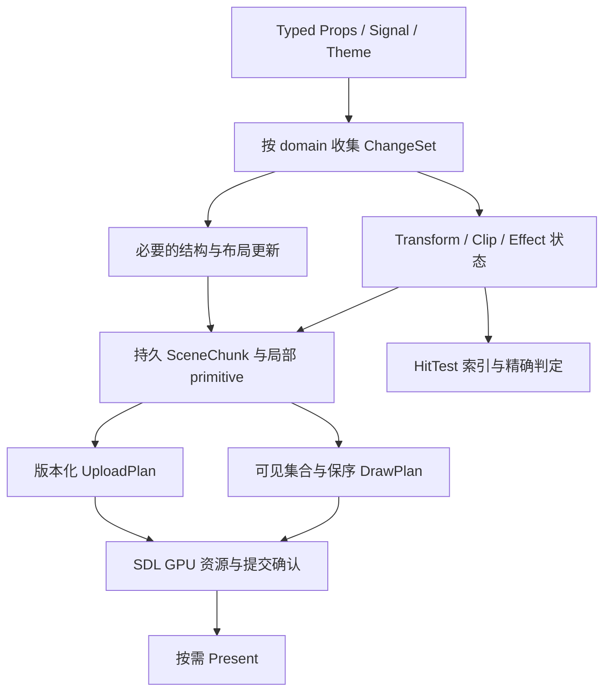

# RynUI UI 渲染与场景系统高性能设计调研

调研日期：2026-09-25。状态：**研究建议，未实施、未进行性能验收**。

本文从响应传播、布局、场景、输入、文本、内存和 GPU 提交的完整链路设计性能演进路线。它是独立研究文档，不取代 [正式架构](../architecture.md)，不修改现有 OpenSpec change，也不构成代码实施授权。后续采纳的方案应进入独立 change，再通过对应阶段的实际验证。

源码审阅基线为 `main` 的 `e02c7c8eac541007352c9f5ef3db5d7ba659ee62`。调研开始时工作区已有组件、主题和 Gallery 的未提交改动；下文源码事实表使用当时与该提交一致的文件，未将这些在途改动视为正式基线。外部资料均于调研日检索，明确区分论文、作者工程报告和官方 API 合同。本文没有把源码推断、历史测试记录或外部项目成绩当作 RynUI 的实测结果。

## 1. 核心判断与优先级

建议保留 RynUI 的细粒度 Reactive、retained Node、typed Props、专用 Quad/Glyph/RoundedEffect 渲染器及单 UI owner thread。主要演进方向是：**把现有局部更新能力延伸到帧流水线的每一层，使普通更新成本主要取决于变化量、可见量和必要依赖，而不是全部挂载节点数。**

当前已经具备 generation identity、局部 instance 更新、按需帧请求、文本 shape/measure 分离及稳定组件 topology。继续优化不应退回每帧构造完整描述树，也不应为了统一渲染而把所有圆角矩形和小字号文字改成通用 Path。

| 优先级 | 建议 | 主要解决的问题 | 启用条件 |
| --- | --- | --- | --- |
| P0 | 建立整帧工作量与延迟基线；明确 GPU 上传事务和资源生命周期 | 局部上传掩盖全局扫描；CPU 提交时间误当 GPU 时间；失败后丢更新 | 所有后续阶段的前置条件 |
| P1 | generation-aware 脏队列、一次性脏区合并、glyph key 索引、受控 staging arena | 重复查找、重复排序、小上传产生大量资源操作 | 不改变公开 API 和视觉合同 |
| P2 | 保持稳定句柄的 primitive 分段存储、retained paint chunk、共享 transform/clip 状态 | 改短文本搬动后续实例；滚动逐子节点写入；全量场景拼装 | 具备一致的 revision 与失效规则 |
| P3 | 布局依赖缓存、局部根、可见集合与命中索引、数据虚拟化 | 布局与输入仍受总规模影响 | 相应容器有明确尺寸依赖与滚动合同 |
| P4 | 成本驱动的合成缓存、damage、保守遮挡剔除 | 高 DPI 下静态复杂内容反复消耗 fill rate | GPU 测量证明回本，内存可控 |
| 实验 | CPU SIMD、GPU scan/binning/indirect、异步纯计算、可选 Path renderer | 大画布、海量动态 primitive、复杂路径 | 前述方案后仍有对应瓶颈 |

其中 P2 的稳定存储、共享变换和 chunk 边界是场景设计的重点；P3 的虚拟化决定十万行 Table/Tree 能否成立。GPU 算法是特定工作负载的后续选择。

## 2. 当前实现：已有能力与扩展成本

表中的复杂度是根据实现推导的上界或风险，不是性能采样。`N` 为挂载节点数，`D` 为本轮不同脏对象数，`I` 为交互记录数，`H` 为树高，`G` 为 glyph 实例数，`A` 为 atlas 条目数，`R` 为不相交上传区间数。

| 位置与符号 | 源码可确认的行为 | 对设计的含义 |
| --- | --- | --- |
| [NodeStore](../../src/runtime/node_store.hpp)：`NodeId`、`Slot` | slot + generation，`deque<Slot>`、节点自己的 children vector、free list | 已有稳定身份。不能为 cache locality 直接改成会使长期引用失效的 vector |
| [DirtyQueues](../../src/runtime/invalidation.cpp)：`enqueue_unique`、`layout_root_for` | vector 线性去重；Measure/Layout 向上走到 Node 树根 | 批量不同节点入队可出现 `O(D²)` 比较；寻找根含 `O(DH)` 工作 |
| [LayoutEngine](../../src/layout/layout_engine.cpp)：`measure_node` | Leaf intrinsic 已按 revision + constraints 缓存；容器递归 measure，Flex 还涉及分配和子项顺序 | 已有叶子缓存；欠缺的是经过证明的容器依赖裁剪，不能声称完全没有缓存 |
| [TextComponentHost](../../src/component/text_component.cpp)：`layout_and_synchronize` | 任一 layout/placement root 非空会遍历 root components 做布局；随后扫描 mounted texts，有离屏跳过 | placement 队列存在不等于宿主已完全实现只 place；离屏跳过不等于避免扫描 |
| [窗口服务](../../src/component/button_component.cpp)：`WindowComponentServices::layout_and_synchronize` | 依序同步参与者、effects、fragments；只在结构或文本 fragment 变化时 composer rebuild；布局后逐 interaction refresh | 已能复用场景拓扑；仍需衡量参与者扫描和批量 hit-test refresh |
| [ComponentHost](../../src/runtime/component_host.cpp)：`paint_traversal` | 缓存 paint traversal，仅 dirty 时重建 | 不应把它误述成每帧重建整棵 component tree |
| [ComponentSceneComposer](../../src/component/component_scene.cpp)：`rebuild`、`build_visible_scene` | rebuild 拼接 fragment 并检查 interaction 重复；visible scene 再扫 traversal；普通 fragment 用 root bounds 加 32 logical px，effect 另有实际 bounds 剔除 | 可见性扫描为全量；interaction 检查存在二次复杂度风险；统一 bounds 应覆盖真实 ink/effect，不能永久依赖常数外扩 |
| [HitTestSnapshot](../../src/input/interaction_registry.cpp) | rebuild 线性查重及查 parent；refresh 遍历 records × dirty 并检查祖先；查询倒序扫描 | rebuild 可达 `O(I²)`；refresh 可达 `O(IDH)`；点查询最坏 `O(I)`。简单场景仍可能比复杂索引快 |
| [GalleryDocumentViewport](../../examples/token_gallery/gallery_document_viewport.cpp)：`translate_subtree` | 一次滚动递归为每个后代写相同 translation | 滚动至少做子树规模的属性访问，还会放大 dirty queue 成本 |
| [QuadInstanceStore](../../src/graphics/quad_primitive.cpp)、[GlyphInstanceStore](../../src/graphics/glyph_scene.cpp) | 稠密 vector；变长 replace 会移位后续数据；`mark_dirty` 每次 push 后 sort/merge | 文本局部变长可能触发尾部搬移与上传；最坏离散脏区重复整理明显超过一次 `O(R log R)` |
| [TextSceneService](../../src/text/text_scene_service.cpp)：`synchronize`、`remap_following`、`rebuild_ordered_scene` | 内容/位置重建后可能调整后续 range 并重建文本 ordered scene；material 和可 patch geometry 有独立路径 | 需要保留现有快路径，解除物理连续地址与文本逻辑顺序的绑定 |
| [GlyphAtlas](../../src/graphics/glyph_atlas.cpp)：`find`、`allocate` | 条目线性找 key；shelf 分配；默认 1024² R8、最多 8 页，耗尽返回错误 | `G` 次查找最坏 `O(GA)`；应先加索引，再设计有预算的淘汰，不能先粗暴删页 |
| [RoundedEffectStore](../../src/graphics/rounded_effect.cpp)：`compact` | 已有 stable slot、packed index、bounds、material/geometry patch；非 dirty 且 clip 不变可跳过 compaction | 可复用其身份与物理位置分离思路；拓扑变化时仍有压紧及全范围更新 |
| [GlyphGpuResources](../../src/renderer/sdl/glyph_gpu_resources.cpp) | 已做 dirty ranges 合并，有可配置的小跨度稀疏上传合并；atlas 按 dirty rectangle 上传 | 上传优化应统一成本模型，不能说当前完全没有 coalescing |
| [SdlSceneRenderer](../../src/renderer/sdl/scene_renderer.cpp) | 已支持 buffer copy batch；每次 buffer upload 仍创建/map/release transfer buffer；atlas 上传独立提交；每帧 clear 后绘制 ordered scene | batch 减少提交数，不等于减少 transfer 资源创建；全画面重绘与局部 buffer 上传是两件事 |

现有 [Input allocation benchmark](../../tests/input_scene_allocation_benchmark.cpp) 对 256 个 Input 的稳定 selection/composition-selection 更新约束零分配、无额外 shape/layout、无无关 atlas/effect 上传和稳定 scene topology。这是重要合同入口，但它使用 CountingGpu，不能据此证明真实 SDL transfer buffer 没有分配或 GPU 没有等待。本次未运行该 benchmark。

## 3. 性能模型：先消除无关工作，再减少单次工作成本

把一帧 CPU 工作拆为：

```text
Tcpu = Tinput + Treactive + Tstructure + Tlayout
     + Tscene + Tvisibility + Tupload_encode + Tsubmit_cpu

Tgpu = Tcopy + Tvertex + Tfragment + Tcomposite
Linput = 事件等待 + UI 排队/计算 + GPU 排队/执行 + 展示等待
```

CPU 与 GPU 可以重叠；不能简单把两个总耗时相加当吞吐，也不能用 `SDL_SubmitGPUCommandBuffer` 的墙钟时间当 GPU 耗时。swapchain acquire 的阻塞时间必须独立记账。关注 p50/p95/p99、最长停顿和输入到展示延迟，不只报平均 FPS。

建议记录三个不同的“局部”：

1. **计算局部**：本帧访问了多少 Node、TextRecord、Interaction 和 fragment？返回未变化也算访问。
2. **传输局部**：实际复制了多少 byte、发出多少 copy region、创建多少 staging 资源？
3. **像素局部**：执行了多少 draw、涉及多少像素及透明 overdraw、创建多少离屏 target？

理想稳态是 `O(受影响依赖 + 可见候选 + 必要上传)`；全局换主题、resize 或 Flex wrap 的最坏情况仍可能 `O(N)`。目标是让必要的全局工作显式发生，而不是宣称任何更新都 `O(1)`。

在稳定约束、稳定 topology 下，改变一个 Button 颜色应达到：无新 mount、无 measure/place、无 shape、无全局 scene rebuild，只更新该 surface 的 material 数据。最终画面若采用 direct draw，仍需绘制可见场景；该事实不能被“单 instance 更新”掩盖。

## 4. 总体结构：逻辑所有权、视觉属性和物理存储分开



建议新增类型均为内部设计，不是本次引入的新公开 API：

| 数据结构 | 保存什么 | 更新粒度 |
| --- | --- | --- |
| `ChangeSet` | generation-aware dirty IDs、domain、revision、原因 | 属性或结构变动 |
| `SceneChunk` | 稳定句柄、paint 序、primitive span 句柄、局部 visual bounds、属性状态引用 | 一个可独立复用的绘制片段 |
| `TransformState` | parent、局部变换、缓存 world/inverse 变换、revision | 一个变换组或滚动根 |
| `ClipState` | parent、geometry、所属 transform、revision | 一个裁剪边界 |
| `EffectState` | group opacity、隔离/合成依赖、输出 bounds | 一个确有组语义的效果范围 |
| `PrimitiveArena` | 稳定 span identity → page/offset/count/capacity | 一个 surface 或文本 run |
| `DrawPlan` | 只读、有序的可见 chunk/range 和 batch key | 可见性、顺序或资源绑定变化 |
| `UploadPlan` | 源/目标版本、range、staging offset、提交状态 | 一次资源更新事务 |

保持 Node/Component 的逻辑生命周期；scene 不回调组件构建函数。`SceneFragmentId` 继续表达现有 before/after children 顺序，chunk 是其渲染存储和复用单元，不创造第二套生命周期所有权。

`NodeId`、primitive handle、resource handle 都携带 generation。slot 的 generation 与内容 revision 分开：前者判断“是不是原对象”，后者判断“对象的哪个版本”。销毁、迟到消息、缓存、hit-test 和 GPU retirement 都必须检查对应身份。

## 5. 增量调度与布局

### 5.1 从线性去重改为带 generation 的稀疏工作集

每个 domain 保留 dense work vector，另有按 slot 索引的 `queued_generation` 和 `queued_epoch`，或等价的 generation-aware bitset。首次 invalidate 入队，重复只 OR domain/reason；保持首次入队顺序，不依赖 hash 遍历顺序。

```text
invalidate(id, domain, revision):
    校验 id.generation
    合并该 domain 的最新 revision
    若本处理轮次尚未入队：记录 generation/epoch，append(id)

drain(domain):
    取本轮快照；跳过已销毁 generation
    按阶段处理；回调产生的新失效进入明确的下一轮
    仅确认已经处理到的 revision
```

预分配后单次排队目标为摊销 `O(1)`，消费 `O(D)`，元数据 `O(slot_capacity)`。epoch 回绕时执行受控清理；复用 slot 不能继承旧 generation 的 queued 状态。若一个节点在消费后又被写入，必须允许再次入队；“每帧只允许一次”会丢失合法更新。

Structural、Measure、Placement、Geometry、Material、Text、Transform、Clip、HitTest 仍是不同 domain。不要用一个全局 dirty bit 抹去当前区分。稠密全量变化可以走顺序扫描；在 P0 数据证明拐点前，先实现简单稀疏路径，不加入自动策略震荡。

### 5.2 脏根合并与祖先关系

低变动 topology 可在结构提交后缓存 DFS 的 `tin/tout/depth`。按 `tin` 排序 dirty roots，删除已被祖先覆盖的项，成本为 `O(D log D)`；祖先测试为区间包含。**重挂载或移动子树会使 DFS 序失效**，此时先重建对应结构索引，不能声称动态插入也是常数成本。第一版可重建受影响树；高频中间插入以后再考虑 order-maintenance 或分块序列。

没有依赖证明的容器仍向上失效。不要机械地在最近组件根截断：子节点尺寸可能影响父 Flex 的分配、wrap、兄弟的位置，以及更外层的 intrinsic size。

### 5.3 容器缓存与布局边界

建议 cache key 至少包含：Node generation、layout model revision、外部 style revision、constraints、参与排版的 child order/size revisions、文本 intrinsic revision。父级最终分配的 forced width/height 也是输入；不得只比较 Node 自己的 dirty 标志。

可逐步实现两类停止条件：

- **测量停止**：新的输出尺寸、baseline 和父级真正使用的 intrinsic 信息均相同，可停止向上继续传播。节点内部的待布局工作仍须完成。
- **放置停止**：最终 constraints、分配 rect、相关 child geometry revision 都相同，才可复用子树放置结果。父 rect 相同不代表子项尺寸没有改变。

给每种 layout model 显式声明 `depends_on_child_size`、`depends_on_available_width`、`needs_measure_for_placement` 等内部性质。固定尺寸裁剪 viewport 可能形成边界；`auto` 大小、百分比分配、Flex shrink/grow 与换行不能默认形成边界。

纯 order/gap/placement 路径是否能只 place，由算法合同决定。保留“完整布局”参考路径，用随机子树变更与增量路径比较输出；性能优化不能以少计 measure 次数而掩盖错误尺寸。

### 5.4 Reactive 层的定位

借鉴 self-adjusting computation 的依赖与复用思想 [R1]：记录真正影响结果的输入，等值输出停止向下扩散。但 RynUI 已有 Reactive，不建议重新引入自动跟踪所有 C++ 内存读写的通用运行时。优先把相同原则用到 layout、scene、visibility 的 revision 边界；依赖粒度太细会增加索引和生命周期成本，太粗会重新计算无关工作。

## 6. 场景存储、绘制顺序与分块

### 6.1 稳定 span：解除局部文本编辑与全局搬移的关系

目前文本 range 的逻辑顺序与一个连续 vector 的物理顺序耦合。建议保留稳定 `PrimitiveSpanId(index, generation)`，解析到 `page + offset + count + capacity`：

- 同长度或容量内更新：原地更新当前 span。
- 超容量增长：在 size class/page arena 中分配新 span，只迁移此 span，更新一次间接表。
- 释放：立即移出逻辑 scene；物理空间在最后使用它的 GPU fence 完成后才可复用。
- 碎片整理：作为受预算的维护任务；建立新地址表并在一个 frame epoch 原子切换，旧页延迟回收。

文本 run 的增长目标为 `O(该 run 的新 glyph 数)`，而不是 `O(后续所有 glyph)`。分配失败时继续保留可用旧版本并返回明确错误/安排重试；不能释放旧 span 后才发现新分配失败。容量增长系数和 size class 由数据确定，记录碎片率 `1 - live_bytes / reserved_bytes`、搬移 byte 数和高水位。

代价是更多 span 和 draw ranges。第一阶段采用分页 buffer + 连续 range 绘制，允许相邻兼容 range 合并；若 draw call 成为瓶颈，再评估 storage buffer 间接寻址或 draw-index stream。不能为了稳定 CPU handle 引入每帧全量 gather，把尾部搬移转移到另一个位置。

### 6.2 SceneChunk 的边界

chunk 按共同变换、裁剪、效果和更新频率组织；通常是一段文本、一个复合 surface 或一个虚拟列表 row 的片段。不要一开始固定为“一 Node 一 chunk”或“整个窗口一个 chunk”。块太碎会增加调度和 batch 开销，块太大会扩大失效。

保存真实局部 visual bounds，包括 glyph ink、边框、抗锯齿 guard、shadow 的 spread/offset/blur 范围。bounds 是保守超集；effect bounds 复用已有计算，不能退化成固定 32px。子树聚合 bounds 的更新沿受影响祖先传播；纯 material 变化只有在影响可见覆盖范围时才更新 bounds。

区分三种缓存，不共用一个 `cached` 布尔值：

1. primitive 内容缓存：实例内容不变，不重建/重传。
2. draw-plan 缓存：可见集合、绘制次序及绑定不变，不重新拼表。
3. raster 缓存：复用离屏像素，需要 texture、失效和分辨率合同。

前两种优先，第三种见第 11 节。

### 6.3 保序 batch

第一版继续按 painter order 输出，只合并相邻且语义兼容的 range。未来完整 batch key 至少包含 pipeline、texture/atlas page、clip state、transform binding、blend convention、render target 和隔离范围。

不得先按材质全局排序再修补透明错误。非相邻合批仅在保守 bounds 无重叠、没有 clip/effect/backdrop 依赖并保持相对顺序可交换时考虑；引入证明本身的 CPU 成本也要计入。

paint traversal 的 topology revision 改变才更新顺序。空间查询通常不保序，输出候选必须按 paint rank 恢复顺序，成本一般为 `O(V log V)`；或利用分块已排序列表合并。若仍扫描整个 `N` 长 order vector 做 membership 过滤，就不能声称端到端 `O(V)`。

透明色与图层语义以 Porter–Duff 合成为基础 [R3]。同色、同 alpha、同纹理只是部分兼容条件。圆角抗锯齿边缘和 glyph coverage 即使主色 alpha=1 也不是全矩形 opaque。

## 7. 共享 Transform、Clip 与 Effect

Chromium property trees 将视觉属性从内容描述中提取，Qt Quick batch root 让一组 retained geometry 共享变换 [R4][R5]。对 RynUI 的建议是采用这两个原则的受控子集，不复制完整浏览器布局和多进程架构。

### 7.1 滚动根与局部坐标

primitive 保存局部 logical geometry，scroll root 维护一个 transform。纯滚动先更新该组 transform，再查询局部 viewport；GPU 通过每批 uniform 或索引化 transform table 读取变换。

若某滚动容器有一万个子节点、仅百余可见，滚动不应写一万个 Node translation 或 glyph instance。目标是变换更新 `O(变化的变换组)`，加上可见查询、进入/离开 viewport 的工作及可见绘制；并非整帧 `O(1)`。

这需要明确迁移语义：当前 Gallery 向全部后代写入相同 translation，是既有平移约定。新组变换不能再次叠加这些旧值，否则发生重复滚动。CPU bounds、shader、hit-test、focus reveal 和 IME caret area 必须同一阶段切到新坐标合同。设 `world = parent_world × local`，clip 自身记录所属坐标空间，避免把窗口空间 clip 当成子空间 clip。

不要把 `world_version` 的更新再次展开成所有后代写入。普通局部移动可增量更新受影响变换子树；常见滚动组保持子内容的局部坐标索引，用组级 world transform 完成映射。复杂嵌套非均匀变换按受影响属性节点计算，最坏仍可线性。

### 7.2 Clip 层级

轴对齐矩形可先 CPU 求交，使用 scissor 或现有 shader clip。旋转/圆角等复杂 clip 才选择 analytic clip、stencil 或 mask；每条路径都需估算额外 pass/纹理成本。不同 clip 空间不能只对原始 rect 数值求交。

clip cache key 包含 geometry revision、transform revision、父 clip revision 和 render scale。多重圆角 clip 的精确相交不能被一个外接矩形替代；外接矩形只用于 broad phase。对奇异变换定义无可逆命中/保守绘制的确定行为，不允许 NaN 传播。

### 7.3 Group opacity 必须与逐 primitive opacity 区分

两个不透明重叠图形分别乘 0.5 alpha，重叠处合成 alpha 为 `0.5 + 0.5 × (1 - 0.5) = 0.75`；先作为一个组绘制再对整组乘 0.5，组输出 alpha 为 0.5。因此组 opacity 不能总下推到子实例。需要隔离合成时建立 layer；能证明不重叠等价时再下推。

当前 scene pipeline 使用 straight-alpha 色因子；若加入离屏透明层，建议定义明确的 premultiplied 中间表示，并在 shader 输出、blend state、纹理采样与颜色空间之间统一转换。不能只把 blend factor 改成 `ONE`。用上述两图重叠、透明文本边缘、多层 shadow 和 linear/sRGB 边界做参考图验证，既有视觉基线优先。

## 8. 可见性、空间索引与输入

### 8.1 根据场景选择索引

| 场景 | 首选结构 | 查询/维护成本与限制 |
| --- | --- | --- |
| 少量控件或几乎全屏可见 | 连续数组倒序扫描 | `O(N)`，常数小、顺序天然正确；作为参考及小场景快路径 |
| 规则二维密集面板 | uniform grid / 分块网格 | 候选与覆盖 cell 数相关；巨大对象和聚集场景会退化 |
| 不规则编辑画布、浮层 | 局部坐标 dynamic AABB tree | 平衡良好且重叠有限时接近 `O(log N + K)`；最坏 `O(N)`，需记录访问数与维护成本 |
| 一维虚拟列表/表格 | 行高前缀和索引 | 直接定位行区间，避免通用二维 BVH |
| 嵌套滚动组 | 组级索引 + 组内局部索引 | 滚动改变 query transform，无需更新全部后代 AABB |

dynamic AABB tree 的工程参考来自 Erin Catto 的设计 [R6]；这是数据结构参考，不建议为 UI 引入整套物理引擎。BVH refit 后重叠可能持续增大，要观察访问比和面积质量，在维护预算内局部重建。tiny scene 不强制走树。

### 8.2 命中精度与一致性

空间索引只提供候选；最终按 paint rank 从高到低检查 live generation、eligible、祖先 gate、精确 clip 和几何。坐标先通过 inverse transform 映射到同一空间。pointer capture、focus、Tab 顺序和 accessibility 不能由“当前是否画出来”决定。

HitTestSnapshot 的 rebuild 查重/parent 查找优先使用 generation-aware interaction→record 索引，先消除二次开销，再谈 BVH。refresh 通过 node→interaction 与子树区间或局部组索引确定受影响记录，避免每次 `records × dirty × ancestors`。

同一 UI epoch 内，布局、视觉属性、可见集合和命中索引必须一致。最小化或无 swapchain 不应冻结逻辑输入状态；恢复时应绘制最新有效 epoch。若将来采用异步呈现快照，必须明确定义输入取最新逻辑状态还是已呈现快照，不能偶然混用两个版本。

### 8.3 保守遮挡剔除

先做 viewport/clip 剔除，再考虑遮挡。只有证明目标区完全被前景不透明内容覆盖，且被剔除内容不参与 backdrop 等其他效果依赖，才能跳过对应绘制；圆角外接矩形、阴影、透明纹理、AA 边缘不能贡献整块遮挡。

可以维护粗 tile coverage bitset，仅记录“完全覆盖”的 tile。front-to-back 分析可跳过全遮挡 chunk，但输出仍恢复正确 painter order。扫描遮挡图、维护 bitset 和恢复顺序的成本须小于省下的像素成本；小窗口或高动态场景默认关闭。

## 9. 大数据 UI：虚拟化先于渲染吞吐

一百万条数据不应等于一百万个 mounted Node、Signal、TextState 或 glyph run。数据模型可为 `O(N)`，活跃 UI 对象目标为 `O(V + overscan + pinned)`，其中 pinned 集合有明确上限和生命周期。

### 9.1 VirtualList / VirtualTable

固定行高直接通过除法定位。可变行高使用 Fenwick tree：点更新高度和 prefix sum 为 `O(log N)`，非负高度前提下用二进制提升查找给定滚动偏移所属行，目标 `O(log N)` [R7]。行高为 0 时也要定义 lower-bound 的确定边界。

Fenwick 不擅长频繁的任意位置插入/删除：普通数组实现会重排索引。大量结构编辑采用带 subtree count/height sum 的分块 B-tree/rope；只做尾部日志追加可继续使用数组与批量扩容。不要把所有场景塞进一种结构。

未测行高先用估值；测量后以 stable item key + 行内偏移保持 scroll anchor。一次 frame 合并高度修正，防止边滚边改滚动位置造成震荡。行回收时必须解绑旧 scope/subscription，并使用新 generation；selection、编辑草稿等逻辑状态归数据 key，不归回收槽。

Table 还需列虚拟化与冻结行/列的独立 transform/clip，不能只减少行 Node 而继续 shape 所有列文本。跨合并单元格、自动列宽是显式依赖，必要时允许预算化扫描数据或使用单独测量模型。

### 9.2 VirtualTree 与输入

用展开状态维护可见行序列；结构频繁变化时用支持 subtree aggregate 的序列树。点展开产生的工作至少与新可见项数相关，不能声称展开十万后代也恒定时间。

聚焦、pointer capture、IME composition 的行不能任意回收。可选择少量 pin，或先提交明确的 focus/编辑生命周期转换；超过 pin 预算时按产品合同处理，不丢失文本。键盘导航定位到未挂载 item 时先实现化目标并完成布局，再把焦点和候选窗定位过去。逻辑可访问性树与绘制虚拟化分离。

离屏内容允许推迟 glyph raster 和 primitive realization，但数据状态更新、必要 layout metadata 与不可丢事件继续处理；重新进入 viewport 时消费最新 revision，不重放过期视觉中间帧。

## 10. 文本、字形缓存和内存布局

### 10.1 文本四层缓存

1. UTF-8 / grapheme / editing：跟随内容 revision；保留现有 Unicode、IME 和 caret 合同。
2. Shaping：key 包含文字内容及碰撞验证、字体链/face identity、logical size、字体配置 revision，以及实际支持的 script/direction/language/features。未支持字段不能因为缓存设计而宣称支持。
3. Line layout：另以 shaped identity、宽度、line height、wrap/ellipsis 等实际布局输入为 key；颜色和 translation 不进 key。
4. Raster atlas：key 包含 font identity、glyph id、raster size、phase、mode；未来字体 variations/hinting 等若可变也纳入 key。

每个缓存同时有 byte budget、generation 和淘汰统计。现有 TextState 已分离 shape/layout/material，应在其上复用结果，而非让每一层各保存一份无上限文本副本。对于少量只用一次的长字符串，共享 shaping cache 未必有收益，允许绕过缓存。

### 10.2 GlyphAtlas：先索引，后淘汰

第一步给现有稳定 entry 存储增加 key→entry index 的开放寻址表或等价 flat hash 索引；查询期望 `O(1)`，冲突用完整 key 判断，预留负载因子和扩容预算。entry 地址稳定不等于 GPU UV 永久有效，二者必须区分。

第二步才处理多字体、多 DPI、CJK 导致的容量压力：

- page 或 allocation 带 generation；glyph instance 间接引用有效 residency，或维护被迁移 entry→consumer 的反向表。
- 本帧可见 glyph 和 in-flight 引用 pin；fence 未完成时不能复用相同物理区域。
- 分别限制 CPU coverage、GPU atlas、shape cache 和待上传 staging 的预算，避免只统计 GPU 八页。
- 先尝试有界回收/新页；失败时采用明确的资源错误与重试/受控回退，不把旧 UV 指向新字形，也不静默丢字。

逐 glyph LRU 与 shelf 孔洞回收组合并不简单。首版可使用按字体/尺寸分组的页和页级回收，以可解释的浪费换简单生命周期；只有碎片数据证明必要时才改 skyline/max-rects 等分配器。不要为了 packing 利用率牺牲查找、迁移和上传成本。

### 10.3 小字号文本与滚动清晰度

保留 HarfBuzz shaping + FreeType grayscale coverage 的基线。MSDF/SDF 或 GPU outline 是大缩放文字/Canvas 的候选，不能默认替换 12–16px CJK。不同字号、DPI、hinting 和 raster phase 的结果需实际比较。

当前 `set_phase_preserving_scroll_translation` 已处理滚动 phase；共享 transform 迁移必须保留该目标，不能仅以“GPU 矩阵更快”接受文字抖动。连续逻辑滚动、物理像素对齐与 phase 选择应有明确规则；DPI 变化同时影响 raster identity、clip、效果 bounds 和缓存，不应重用旧密度 atlas 放大冒充重栅格化。

### 10.4 Hot/cold split 与内存预算

先测 cache miss 与 working set，再调整存储。Node 的 children/style/debug counter 不必都进入每帧扫描的数据；可建立紧凑的 hot arrays 存放 bounds、property IDs、revision。保持既有 Node 引用合同，第一阶段可通过旁路 hot projection 试验，不重写整个 NodeStore。

现有 Quad instance 为 48 bytes，Glyph 为 80 bytes，RoundedEffect GPU instance 为 112 bytes。若单独抽出 material/transform 流，上传可能更少，但会增加 GPU fetch、binding 和 shader 复杂度；按 primitive 类别做 A/B，不能仅看结构体变小。

示例预算（纯算术，不是当前占用）：10 万 glyph 的单份 80-byte instance 约 7.63 MiB，三份约 22.89 MiB；3840×2160 RGBA8 离屏 target 单份约 31.64 MiB，两份约 63.28 MiB，尚未计 staging、atlas、mask、CPU 副本和驱动开销。大窗口不能无条件按层双缓冲。

## 11. GPU 上传、合成与帧事务

### 11.1 脏区整理与成本驱动上传

将每次 `mark_dirty` 的 sort/merge 改为 append，上传规划阶段按 buffer 一次排序、去重和区间合并，成本约 `O(R log R)`。大量 dense 更新可使用页级 bitset，并仅枚举 touched pages；每帧扫全部 bitset 的 `O(capacity/word)` 也要计账。

合并有间隙的 range 时使用成本模型：

```text
Tupload ≈ region_count × fixed_cost
        + copied_bytes / effective_bandwidth
        + staging_pack_cost

两 range 合并的条件：复制 gap 的额外成本 < 省掉一个 region 的成本
```

`fixed_cost` 和带宽来自实测校准，不把某个固定 4 倍跨度规则当所有平台的最优解。统一规划 Quad/Glyph/Effect，分别计 logical dirty bytes、实际上传 bytes 与 amplification；限制总 over-upload。全量变化允许一次顺序上传，避免维护精细列表反而更贵。

### 11.2 Staging arena 与提交边界

每个可复用 frame resource slot 保存有容量上限的 transfer arena，批量 map、拷贝多段、unmap，在 copy pass 中引用各 offset。纹理 row pitch/offset 使用后端规定的对齐，不能照搬普通 buffer 的规则。atlas 与 instance 数据先形成一个可审查的 upload plan，再决定是否合入同一 command buffer。

不要把“一个 copy pass”写成无条件要求：资源依赖或后端特性允许拆分，只要顺序与确认状态清楚。对于有 atlas 新增的帧，需要保证 glyph draw 依赖的 texel 上传在先；不能仅优化已有的 buffer-only batch。

上传要分清 `prepared`、`encoded`、`submitted` 和 `retired`。encoded 不意味着 GPU 收到，submitted 不意味着 GPU 完成。建议在提交成功后确认资源的 dirty revision；失败时保留重试信息或标记资源需全量恢复。特别是现有 buffer batch 中 `upload()` 可以只是编码成功，store 随后 clear dirty，而外层 finish 才提交；后续设计必须覆盖 finish 失败这个边界，不能只测试单次 upload 返回 false。

### 11.3 Cycling 不能直接叠加局部更新

官方 SDL 合同说明，cycling 后的资源内容在重新写入前视为未定义；它不会自动复制未更新部分。transfer buffer cycling 与目标 GPU buffer cycling 是两个独立操作 [R8]。仓库锁定 SDL 3.4.14，本地依赖头文件亦包含该合同；参考 [依赖锁](../../cmake/dependencies/RynUIDependencyLock.cmake) 和 [锁定源码](https://github.com/libsdl-org/SDL/blob/147a8ee32dbf9ac02f3794964490687b6bbda1bc/include/SDL3/SDL_gpu.h)。

因此不能把所有 `SDL_UploadToGPUBuffer(..., false)` 改成 `true`，然后只上传本帧 D 个 instance。建议选择并比较以下明确策略：

| 策略 | 正确性条件 | 代价 |
| --- | --- | --- |
| 单份目标 buffer | 确认需要覆写的旧引用已退役；不得覆写仍被未完成命令使用的数据 | 内存小，可能等待；适合基准/低频路径 |
| 每资源多份 replica | 每份有 `applied_revision` 与最后使用 fence；先等该份可写，再补齐它缺失的所有 delta | 小变更可少传，但有历史日志和 replica 内存 |
| cycling + 完整有效内容重建 | 每次新 backing 写全本次 draw 会读取的数据 | 简单，可能大量传输；适合小 buffer 或高变更比例 |

建议先试 bounded replica + journal：CPU authoritative store 持有最新数据，journal 记录受影响 page/range 与 revision。选到 replica `v` 时补齐 `(v, current]` 的全部变化；journal 超预算或发生不可兼容结构迁移时重新上传完整有效内容。初次 replica 同样全初始化。日志按仍可复用 replica 的最老版本回收，不能只保留“上一帧”。

frame slot 数量有上限，并由提交 fence 证明可复用，不假定“三帧后肯定安全”。slots 全忙时采用受控等待或推迟当前视觉提交，继续合并最新可丢中间视觉状态；不可丢输入事件仍按序执行。不要无限分配以躲避等待，也不要每帧等待整个 GPU idle。

当前源码的 `cycle=false` 使用是否产生实际跨帧 hazard，需要结合真实命令时间线和 SDL 后端确认；本文将其列为验证重点，不报告为已经复现的显示错误。

### 11.4 Deferred、失败和销毁

资源上传与 frame present 各有自己的确认版本：upload 已成功、swapchain 暂不可用时，不必重复上传相同资源，但窗口仍保持 `present_pending`。upload 未提交则不能清除对应修改；销毁前取消未提交工作，已提交资源按 fence 延迟回收。对象逻辑死亡与物理 GPU 内存回收不是同一步。

最小化、resize、device/resource 重建需要完整恢复入口；失败不得让 replica 版本虚假前进。同 timestamp 重试不重复推进动画。持久缓存、资源 journal 和 frame request 的恢复都应由可注入失败测试覆盖。

### 11.5 Damage 与离屏缓存的适用范围

SDL swapchain texture 只供本次获取它的 command buffer 使用，并且是 write-only，不能把上帧 swapchain 当持久可采样缓存 [R9]。若要局部重绘，使用自己拥有的 retained target：

1. 由旧/新 visual bounds 的并集产生 damage；移动、删除也必须包含旧位置。
2. 扩张到 AA/shadow/filter 所需范围，并传播相关 layer 依赖。
3. 仅在自有 target 内容有效时 LOAD，恢复 damage 区域的背景，再保序重绘与其相交的所有必要内容，不能只画发生变化的对象。
4. 将最终自有 target 绘到本次 swapchain。最后这一步通常仍是全窗口成本。

透明 layer 的局部清除要采用正确覆盖写入；透明 `src-over` 并不会擦掉旧内容。backdrop filter 或跨 layer blend 会扩大依赖，第一版可保守整层重绘。resize、scale、格式或颜色空间变化使缓存失效。

用 `rebuild_cost / reuse_frames + composite_cost + memory_cost` 与 direct draw 比较。小而便宜的控件通常不值得纹理缓存；大型静态复杂面板才可能回本。设置 layer byte budget、最大尺寸、逐帧维护预算和迟滞，避免不断晋升/撤销缓存。缓存分配失败回退 direct draw，保证视觉语义相同。

### 11.6 多 pass 之后才引入最小 render graph

当前普通 UI 的单 render pass 不需要通用大型 render graph。出现 mask、隔离组、blur 或复用 layer 后，可把每个 pass 及其资源读写声明组织为 DAG；topological sort 的成本为 `O(P + E)`，其中 P 为 pass 数、E 为依赖边数。图通常随效果拓扑变化编译，纯颜色变化复用执行计划。

资源描述至少包含尺寸、格式、采样数、用途和持续性。只允许对生命周期不重叠、描述兼容的 transient target 复用池中纹理；persistent cache、swapchain 与仍被 in-flight 命令引用的资源不能混入同一即时空闲表。graph 负责表达依赖和生命周期，后端负责满足对应同步合同。

图中一个 layer 是语义隔离边界，不代表必须永久占用一张纹理。尽可能缩小 effect bounds；保持相邻兼容 pass 的合并空间。若预算不足，优先撤销可选 raster cache；组 opacity 等必需中间结果不能退化成视觉不同的逐 primitive alpha，必须使用等价低内存路径或明确失败。

## 12. 帧调度与并行边界

保持按事件和 deadline 唤醒：无输入、无动画、无有效更新时不提交。动画、caret、resize 和外部消息合并到同一 frame epoch；不要用固定 16ms timer 绕过现有 OnDemandFrameLoop。

优化目标同时包含响应性：邮件箱 drain、缓存维护、atlas eviction、arena compaction 有时间/数量预算。预算耗尽后把独立维护工作移到后续空闲段；同一 frame 的必需 layout/scene 事务不能发布一半。隐藏窗口停止无意义视觉工作，但不丢逻辑状态和必需完成事件。

第一阶段仍单 owner thread；布局、响应传播和提交不并行改写 NodeStore。可实验的后台任务只消费 immutable input，返回带 owner generation、内容 revision 和 request id 的结果，例如图片解码或可隔离的字体处理。过期结果丢弃，队列有背压；字体 worker 必须拥有可安全使用的独立对象，不能共享可变 face。

论文 [R2] 表明并行增量计算需要控制依赖与工作粒度；这不等于把每个 dirty Node 发到线程池都会更快。只有纯任务成本大于调度、快照和结果合并成本，且对 p99 有收益时，才引入对应 worker。独立 compositor thread 还会改变现有 owner 规则及 SDL 窗口线程边界，属于后续架构决策。

## 13. 论文与前沿路线的实际落点

| 研究/工程资料 | 可借鉴的具体内容 | 在 RynUI 的选择及边界 |
| --- | --- | --- |
| Acar：Self-Adjusting Computation，2005 [R1] | 动态依赖与 memoization 配合，变化传播只重做必要计算 | 用于布局/场景的依赖和 revision 设计；不移植语言运行时，不套用论文的特定复杂度结论 |
| Anderson 等：Efficient Parallel Self-Adjusting Computation，2021 [R2] | 用 SP/RSP 结构表达顺序与并行依赖，分析增量工作与并行深度 | 支持“先减工作，再讨论线程”；暂不让 UI Signal 多线程可写 |
| Porter–Duff：Compositing Digital Images，1984 [R3] | 透明合成的代数与表示 | 作为保序、组 opacity、离屏透明层的正确性基础 |
| Chromium property trees [R4]、Qt Quick batch roots [R5] | 将变换/裁剪/效果与 retained 内容分开 | 直接指导共享滚动变换及 chunk；浏览器和 Qt 性能数字不外推到 RynUI |
| Catto：Dynamic AABB Trees，2019 [R6]；Fenwick，1994 [R7] | 空间层次索引与一维动态前缀和 | 分别服务不规则场景和虚拟列表，按负载选用 |
| Merrill、Garland：Decoupled Look-back Scan，2016 [R10] | scan 可用于 compact 输出及并行地址分配 | 后期 GPU visible compaction/binning 的研究入口；不直接照搬 CUDA 同步假设 |
| Levien、Uguray：GPU-friendly Stroke Expansion，HPG 2024 [R11] | 可并行的 stroke 编码、展开与曲线近似 | 用于未来 Path/Canvas 专项；其 stroke 阶段测试不能当普通控件整帧加速结果 |
| Vello sparse strips / Hybrid，2025–2026 [R12] | CPU 预处理 + GPU raster 的混合路径，以及矩形、图层、glyph 的专门快路径 | 作为可选复杂矢量渲染实验；继续保留常用 UI primitive 快路径 |

2026-04-19 的 Linebender 官方报告将当时的 Vello Hybrid 描述为约 beta 水平，并记录矩形特化、glyph cache 和 layer 优化 [R12]。这是一份有日期的工程状态报告，不是截至调研日所有平台成熟度的保证；也说明通用矢量引擎仍需要针对常用 primitive 做专门优化。

### 13.1 GPU scan/binning 实验应如何限定

仅当 CPU 可见性/命令整理占主要耗时且可见实例规模足够大时，构建实验分支：CPU 输出 immutable primitive stream → GPU coarse binning → stable compaction → 同类兼容 batch 绘制。每 tile 内保留 painter order，不能靠 atomic append 的到达顺序决定透明绘制。

优先使用可证明终止的多 dispatch scan 作为可移植基线，再试单 pass。decoupled look-back 对跨 workgroup 的可见性与 forward progress 有要求；作者的可移植性调查 [R13] 是风险依据，不能被当成 2026 所有驱动的现状结论。实际 shader 能力应以锁定 SDL/编译器和 D3D12/Vulkan 设备实验确认。

所有 bin/output capacity 有 overflow 检查；超出时回退 CPU 或较大受限缓冲并重试，不能越界或无界扩容。实验计算 GPU dispatch、barrier、临时存储和数据上传的总成本，避免只比较最有利的一个 kernel。需要 CPU readback 的可见数会引入同步，优先固定容量/间接命令方案并实测其代价。

### 13.2 当前不建议作为主线

- 全局 GPU 排序按材质重排透明 UI。
- 对每个控件缓存一张纹理，或对每个节点建立独立 heap/线程任务。
- 为了大量数据先扩大 GPU buffer，再挂载所有不可见行。
- 把全文、小字号 CJK 和基础矩形全部交给 SDF/通用矢量 compute。
- 将完整 layout 改成通用约束求解器、ECS 或自动并行运行时，而没有对应瓶颈证据。

## 14. 可验证的实验与性能验收设计

### 14.1 统一测量协议

P0 记录 CPU/GPU 型号、内存、OS、驱动、实际后端、shader 格式、编译器、preset/configuration、源码 SHA、工作区是否 dirty、分辨率、DPI、字体链、vsync/present 设置。Windows 使用正式 MSVC preset；Release 测时，Debug 做诊断，不能用已有未知产物代表当前源码。

每组分 cold start、warm steady state、结构 churn、恢复四段。建议稳态预热至少 300 次目标操作、记录至少 10,000 次，五组独立进程，使用相同随机种子；这只是初始试验协议，需根据场景耗时调整并记录。渲染动画测试按 frame 采样，idle 独立测 30 秒，不能为凑 frame 数人为唤醒空闲窗口。

报告 CPU 阶段 p50/p95/p99/max、GPU 时长、输入延迟、peak/resident 内存、cold glyph 时间、visited/touched 比、draw/pipeline/texture changes、dirty/actual uploaded bytes、copy region/submit 数、staging 创建数、cache hit/eviction、队列长度与回退次数。GPU 时长由平台工具或经过验证的时间戳方案获取；不可获取时写“未测”，不以 CPU 计时代替。

算法复杂度先以工作量计数验证，再看时间。固定 D 与 V，把 N 从 1k→10k→100k 扩大，检查无关访问是否增长；再固定 N 扫 D/N 从稀疏到全量，找到增量/全量的实际交点。对每项优化做单独 ablation，不把同时改动多个模块的收益归因于其中一个算法。

### 14.2 工作负载矩阵

| 场景 | 控制变量 | 必须观察的结果 |
| --- | --- | --- |
| 单控件颜色/hover/caret | N=1k/10k/100k，D=1，V 固定 | 无 measure/shape/remount；无与 N 成比例的无关同步；上传局限于相关数据 |
| 批量主题颜色变化 | D/N=1%、10%、100% | 入队与脏区整理无二次增长；dense 路径交点可解释 |
| Gallery/长文档滚动 | 总节点增长、视口固定、整像素与分数偏移 | 共享 transform 消除逐后代写入；文本不抖动；进入视口更新正确 |
| 局部文本长度变化 | 首/中/末 run 改变，后续 G 扩大 | 稳定 span 不搬移无关 run；无陈旧 range；上传与局部变化相关 |
| 布局变化 | 固定宽度、auto、Flex wrap、字体变更、resize | 增量与完整 layout 结果一致；最坏全局成本明确 |
| 大 Table/Tree | 数据 100k→1M，可变行高、随机更新、展开/收起 | mounted UI 受 V/overscan 限制；anchor/focus/IME 正确；插入复杂度真实 |
| HitTest | 稀疏/高度重叠、1000Hz 输入轨迹、局部移动 | 结果与倒序参考一致；查询加维护总成本更低；capture 不受 cull 干扰 |
| Atlas 压力 | CJK、多字体、多个 DPI、容量耗尽 | 缓存有界、无旧 UV 读到新 glyph、in-flight pin 正确、错误可恢复 |
| 高 DPI effects | 1/1.25/1.5/2 scale，大 shadow、组 opacity | ink/effect bounds 无裁断；alpha/clip 正确；direct/cached GPU 成本对比 |
| GPU 落后与失败 | 延迟 fence、copy/submit 失败、无 swapchain、恢复 | 无丢更新、无读未初始化 replica、无提前复用、队列和内存有界 |
| 长时 churn / idle | mount/destroy/recycle 与 30 秒空闲 | 无 stale generation、内存高水位受控；无动画时不周期提交 |

### 14.3 拟定验收门槛

以下为后续 change 的建议，**不表示当前已通过或承诺的数字**：

- 正确性：scene 顺序、布局、命中和参考路径等价；浮点与视觉容差按具体算法事先定义。不能事后放宽到掩盖字体模糊、漏绘或边缘错误。
- 稳态局部性：纯 material/caret 无无关 mount/measure/shape、scene topology rebuild；在固定 D/V 的规模实验中，无隐藏全 N 扫描的计数增长。
- 生命周期：retained owner/slot 的内存预算明确；故障注入证明 dirty revision 不提前确认，退休资源不提前复用。
- 性能：在固定机器和同场景五组结果中，目标阶段收益超过测量噪声；初始回归线可取小场景 p95 不恶化超过 5%，同时报告置信范围。若基线噪声已超过 5%，先修测量，不能判定通过。
- 帧目标：60/120/144Hz 对应 16.67/8.33/6.94ms 展示周期；具体 CPU、GPU 与排队预算由目标设备上的 P0 结果分配。不能把平均 6ms 当稳定 144Hz，也不预先承诺“十万节点 144Hz”。

### 14.4 平台通用验收

dirty queue、generation、增量 layout 等价性、保序 draw-plan、索引对照、虚拟化、atlas 元数据、失败事务与 allocation 合同在一个受支持正式平台/preset 验收一次。复用 [现有 tests 入口](../../tests/CMakeLists.txt)，重点扩展 `hit_test_benchmark`、`gallery_document_benchmark`、`input_scene_allocation_benchmark` 等的工作量观测，不以零分配替代低复杂度。

### 14.5 Windows 验收

独立记录 MSVC、Win32、实际 GPU/backend、DXIL、系统字体、真实 DPI、IME area、透明混合与 fence/resource 生命周期。对应真实窗口、GPU 抓帧和资源高水位数据在 Windows 完成；不能以 headless 或 CountingGpu 结果替代。

### 14.6 Linux 验收

独立记录正式 GCC/Clang preset、实际 Vulkan/SPIR-V、原生 Wayland 或本 change 明确要求的窗口系统、Fontconfig 字体、真实 scale、输入/resize/pacing 及资源生命周期。Windows 结果不替代 Linux，也不重复已完成的平台通用逻辑测试。macOS/Metal 仍属未来平台能力，不因论文讨论 Metal 就声称支持。

## 15. 分阶段落地与回退边界

本文不创建实施 tasks。建议后续按以下依赖分解为独立可验证阶段，每阶段通过相应验收后独立提交；选择具体阶段再建立 OpenSpec 范围。

| 阶段 | 范围与依赖 | 交付和退出条件 |
| --- | --- | --- |
| P0 | 增加观测，固定 benchmark scenes，梳理资源提交/失败状态 | 能区分扫描、上传、GPU 执行和等待；得到真实热点排序 |
| P1a | dirty queue + 一次 range 合并 + atlas lookup index；依赖 P0 | 稀疏与 dense 工作量曲线改善，保持所有既有逻辑合同 |
| P1b | upload plan/ack、staging arena、可证安全的目标 buffer 策略；依赖 P0 | 失败/落后 GPU 测试通过，真实 backend 资源创建数下降；可单独回退到安全完整上传 |
| P2a | 稳定 primitive span，保留旧 ordered scene adapter；依赖 P1b 生命周期 | 文本增长不搬移无关实例；碎片和 draw-call 代价有界 |
| P2b | chunk + transform/clip 状态，滚动与 input 坐标合同；依赖 P2a | 滚动不逐子节点写入，视觉与 IME/hit-test 一致；按窗口整体切换坐标路径 |
| P3a | 局部布局依赖边界；依赖 P1a，保留完整 layout oracle | 每种布局模型独立通过随机/固定回归；未覆盖容器继续保守完整布局 |
| P3b | 可见性/hit-test 索引；依赖 P2b | query + index maintenance 总成本回本；小规模保留线性路径 |
| P3c | VirtualList/Table/Tree；依赖尺寸模型及 P2b/P3a 相应能力 | 数据规模与 UI 实现化规模解耦；编辑/focus/anchor 合同完整 |
| P4 | 有预算的 layer cache、damage、遮挡；依赖 P0 GPU 证据、P2b 与 P1b | 真实 GPU 收益和像素等价同时成立，否则保留 direct draw |
| 实验 | SIMD、GPU scan/binning、复杂 Path、后台纯任务 | 各自独立开关/benchmark；未证明收益时不进入默认渲染链路 |

不需要先做所有 P1–P4 才能获益。若 P0 发现滚动全量扫描远大于 GPU 开销，应优先 P2；若冷 CJK 卡顿占主导，优先 atlas 查询与上传批次；若 UI 是小控件数量的大面积多层 shadow，则测 fill rate 与 effect shader 后再决定 P4。数据决定顺序，但生命周期正确性仍是前置条件。

各模块的边界如下：

- `runtime`：ChangeSet、epoch、Node generation、布局失效和按需调度。
- `layout`：依赖与缓存、完整参考路径、virtual viewport 的测量合同；不认识 SDL。
- `component`：fragment/slot 所有权、typed Props/Token 到 domain 的映射；不承担 GPU 资源回收。
- `graphics`：平台无关 chunk、primitive arena、visual bounds、保序计划和资源 revision。
- `input`：interaction 索引、变换后的精确命中；复用视觉坐标合同，保留独立交互语义。
- `text/font`：shape/layout/raster identity 与缓存预算；不把 CPU 缓存有效等同于 GPU residency。
- `renderer/sdl`：GPU replica、staging、copy/draw 编码、fence 与恢复；SDL 类型留在后端。

## 16. 需要后续数据回答的问题

1. 真实目标窗口的 N/V/D、glyph 数、透明像素面积和持续更新频率分别是多少？Gallery、大表格和工业监控应分别采样。
2. 当前最昂贵的是 dirty enqueue、宿主遍历、hit-test、glyph lookup、transfer 创建、GPU 等待还是 fragment fill？源码复杂度不能替代这个排序。
3. 目标设备是集成 GPU、独立 GPU，还是内存带宽较低的平台？可接受 CPU/GPU 缓存预算和最高刷新率需要产品场景确定。
4. 哪些后续组件需要 group opacity、旋转/复杂 clip、Canvas/Path、图片或视频？只为确实需要的语义增加 effect/render-graph 复杂度。
5. 在当前 SDL 后端和 presentation 配置下，安全的单 buffer、有限 replica 与完整 cycling 上传各自何时回本？保留同场景对照。

这些问题不会阻碍采用明确的局部性和生命周期设计，但会决定参数、实现先后以及实验路线是否进入主线。

## 17. 参考资料

以下链接指向论文原文、作者资料或项目官方文档；正文中的 RynUI 方案为基于这些资料与本仓库源码的设计推导，不是来源声称已经适配 RynUI。外部性能结果未用作本项目验收。

- **[R1]** Umut A. Acar，*Self-Adjusting Computation*，CMU-CS-05-129，2005，[论文](https://www.cs.cmu.edu/~rwh/students/acar.pdf)。重点参考 dynamic dependence graph、memoization 和 change propagation 的区分。
- **[R2]** Daniel Anderson、Guy E. Blelloch、Anubhav Baweja、Umut A. Acar，*Efficient Parallel Self-Adjusting Computation*，2021，[论文及版本](https://arxiv.org/abs/2105.06712)。参考依赖结构、粒度与并行成本，非 UI 性能对照。
- **[R3]** Thomas Porter、Tom Duff，*Compositing Digital Images*，SIGGRAPH 1984，[原文](https://keithp.com/~keithp/porterduff/p253-porter.pdf)。用于透明合成正确性。
- **[R4]** Chromium，[*Platform paint code / Paint properties*](https://chromium.googlesource.com/chromium/src/+/HEAD/third_party/blink/renderer/platform/graphics/paint/README.md)；[*Key data structures in RenderingNG*](https://developer.chrome.com/docs/chromium/renderingng-data-structures)。官方架构资料，涉及 paint chunks 与 transform/clip/effect/scroll trees；HEAD 链接可能继续变化。
- **[R5]** Qt，[*Qt Quick Scene Graph Default Renderer*](https://doc.qt.io/qt-6/qtquick-visualcanvas-scenegraph-renderer.html)。官方动态文档，参考 batching、batch roots 和 retained geometry；不移植其中 OpenGL 专属实现细节。
- **[R6]** Erin Catto，*Dynamic AABB Trees*，GDC 2019，[作者讲义](https://box2d.org/files/ErinCatto_DynamicBVH_GDC2019.pdf)。参考 spatial broad phase、树维护及查询代价。
- **[R7]** Peter M. Fenwick，*A New Data Structure for Cumulative Frequency Tables*，Software: Practice and Experience 24(3)，1994，[DOI](https://doi.org/10.1002/spe.4380240306)。将动态前缀和用于行高是本文的应用推导。
- **[R8]** SDL，[*GPU / A Note On Cycling*](https://wiki.libsdl.org/SDL3/CategoryGPU#anoteoncycling)，[*SDL_MapGPUTransferBuffer*](https://wiki.libsdl.org/SDL3/SDL_MapGPUTransferBuffer)，[*SDL_UploadToGPUBuffer*](https://wiki.libsdl.org/SDL3/SDL_UploadToGPUBuffer)，[*SDL_SubmitGPUCommandBufferAndAcquireFence*](https://wiki.libsdl.org/SDL3/SDL_SubmitGPUCommandBufferAndAcquireFence)。经 Context7 查询并与锁定依赖头文件核对相关合同。
- **[R9]** SDL，[*SDL_WaitAndAcquireGPUSwapchainTexture*](https://wiki.libsdl.org/SDL3/SDL_WaitAndAcquireGPUSwapchainTexture)。swapchain 线程、生命周期、write-only 及空 texture 语义。
- **[R10]** Duane Merrill、Michael Garland，*Single-pass Parallel Prefix Scan with Decoupled Look-back*，NVIDIA Technical Report NVR-2016-002，2016，[作者机构发布页](https://research.nvidia.com/publication/2016-03_single-pass-parallel-prefix-scan-decoupled-look-back)。GPU compact/分配的基础算法入口。
- **[R11]** Raph Levien、Arman Uguray，*GPU-friendly Stroke Expansion*，HPG 2024，[论文 v2](https://arxiv.org/html/2405.00127v2)，[作者项目](https://github.com/linebender/gpu-stroke-expansion-paper)。重点阅读算法适用对象及 GPU 实验规模，区分 stroke expansion 与完整渲染成本。
- **[R12]** Linebender，[*Linebender in March 2025*](https://linebender.org/blog/tmil-15/)；Raph Levien，[*Linebender in 2026 Q1*](https://linebender.org/blog/tmil-25/)，2026-04-19。记录 sparse strips / Hybrid 的工程演进，是项目报告而非对 RynUI 的测量。
- **[R13]** Raph Levien，[*Prefix sum on Vulkan*](https://raphlinus.github.io/gpu/2020/04/30/prefix-sum.html)，2020；[*Prefix sum on portable compute shaders*](https://raphlinus.github.io/gpu/2021/11/17/prefix-sum-portable.html)，2021。作为跨 workgroup 同步与 forward-progress 风险的历史工程分析，实际能力需在当前锁定环境重验。

## 18. 本次交付与验证边界

本次只新增此文档，不改运行时代码、依赖、shader、既有架构或 OpenSpec 任务完成状态。完成源码路径审阅、官方资料与论文检索、方案取舍和可执行的验证设计；未运行新的 C++ 构建、benchmark、真实窗口或 GPU 实验，因此所有加速效果仍待验证。

本次在 Windows PowerShell 执行的文档校验结果：

- `openspec doctor --json`：通过，root healthy。
- `openspec validate --all --strict --no-interactive`：13 项通过，0 项失败；013 的 `skip_specs` 为既有信息提示。
- `git diff --check`：通过。
- 本文 20 个不同的本地 Markdown 链接目标均存在；源码事实表引用的 16 个源码文件与上述 HEAD 一致。

提交只包含此文档。上述结果验证文档和仓库规划结构，不验证拟议算法的运行时正确性、视觉或性能。
