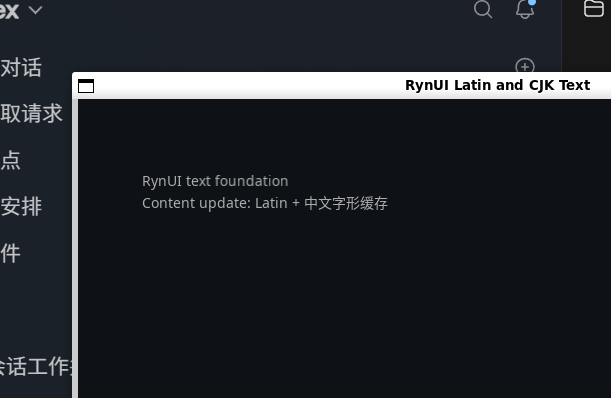

# Linux GCC / Vulkan 真实窗口证据

## 环境与执行

- 环境：WSL2 Ubuntu 24.04
- Configure preset：`linux-gcc`，使用 `cmake --fresh --preset linux-gcc`
- Build/Test preset：`linux-gcc-debug`、`linux-gcc-release`
- Generator：`Ninja Multi-Config`
- Compiler：GCC 13.3.0，`CMAKE_CXX_COMPILER=/usr/bin/g++`
- Dependency mode：`RYNUI_DEPENDENCY_MODE=BUNDLED`
- FreeType/HarfBuzz 来源：build tree 内固定源码目录 `rynui_freetype-src` 与 `rynui_harfbuzz-src`，由 canonical targets `RynUI::FreeType` 与 `RynUI::HarfBuzz` 消费
- Shader 产物：Debug/Release 均生成 `glyph.vertex.spv` 与 `glyph.fragment.spv`
- 真实窗口命令：`out/build/linux-gcc/examples/Debug/rynui_text_demo --smoke`
- GPU driver：`vulkan`
- Shader format：`SPIR-V`
- Exit code：`0`

`linux-gcc-debug` 与 `linux-gcc-release` 均完成 build，最终 CTest 均为 43/43 通过。`rynui.dependency_lock`、`rynui.generated_shaders`、`rynui.glyph_shader_contract` 和隔离的 dependency contract tests 共同验证锁定依赖、canonical targets、SPIR-V 产物与禁止隐式 system-first fallback。

## 计数日志

Debug：

```text
gpu_driver=vulkan shader_format=SPIR-V font_rasterizations=30 font_cache_hits=0 replacement_count=0 fallback_runs=3 shape_count=2 measure_count=4 atlas_pages=1 atlas_entries=30 atlas_uploads=29 atlas_uploaded_bytes=4245 instance_count=176 instance_rebuilds=4 material_updates=1 buffer_uploads=5 glyph_draws=6 submits=6 idle_waits=168 exit_code=0
```

Release：

```text
gpu_driver=vulkan shader_format=SPIR-V font_rasterizations=30 font_cache_hits=0 replacement_count=0 fallback_runs=3 shape_count=2 measure_count=4 atlas_pages=1 atlas_entries=30 atlas_uploads=29 atlas_uploaded_bytes=4245 instance_count=176 instance_rebuilds=4 material_updates=1 buffer_uploads=5 glyph_draws=6 submits=6 idle_waits=173 exit_code=0
```

日志关系与可控 event/clock 集成测试共同证明：content 更新增加 shape 与新 glyph atlas upload；color 更新只产生 Material instance range upload；constraint 与 resize 增加 measurement/instance rebuild，但不会重新 rasterize 已缓存 glyph；稳定后 `idle_waits` 持续增加而 `submits=6` 保持不变，不持续提交空帧。Scene recording tests 验证 Quad/Glyph command 不跨 Z、clip 或 atlas page 边界重排。

## 截图与人工核对



- 截图来自 SDL3 GPU 的 WSLg/Vulkan/SPIR-V 真实窗口，不是离屏 mock。
- 正文使用锁定的 Latin/CJK fallback fonts、14px pixel size、20px line height 和 Ant Design 6.5 dark secondary semantic color（白色 65% alpha）。
- 人工核对：Latin 与中文 glyph 均可见，baseline 连续；`中文` 等字符来自第二字体的 fallback run；12–16px 验收范围内没有 atlas seam、错页采样或 replacement glyph。
- 窗口运行期间依次触发 content、color、width constraint 与 resize 更新；`--smoke` 运行和窗口验收运行均以 `exit_code=0` 正常退出。

## Clang 阻塞

`linux-clang` preset 已实际执行，但当前 WSL 环境没有安装 `clang++`，所以任务 7.2 保持未完成，不声称 Clang 通过。可复现命令与关键错误如下：

```text
cmake --fresh --preset linux-clang
The CMAKE_CXX_COMPILER: clang++ is not a full path and was not found in the PATH.
```

安装 Clang 并确保 `clang++` 可由 PATH 解析后，重新运行 `cmake --fresh --preset linux-clang`、`cmake --build --preset linux-clang-debug` 与 `ctest --preset linux-clang-debug` 即可解除阻塞。

## 最终验收摘要

- Windows MSVC Debug/Release build 与 CTest：分别 43/43 通过。
- Linux GCC Debug/Release build 与 CTest：分别 43/43 通过。
- 隔离的 `SYSTEM` positive/negative contract suite 与 public-header dependency leak check：13/13 通过。
- Windows D3D12/DXIL 与 Linux Vulkan/SPIR-V 真实窗口：均正常退出并有截图、driver、shader format 与诊断计数证据。
- `openspec doctor --json`：healthy；`openspec validate --all --strict --no-interactive`：2/2 通过；`git diff --check`：通过。
- 唯一未完成项是任务 7.2 的 Linux Clang 验收，原因是当前 WSL 缺少 `clang++`；其余 change 验收项均通过。
