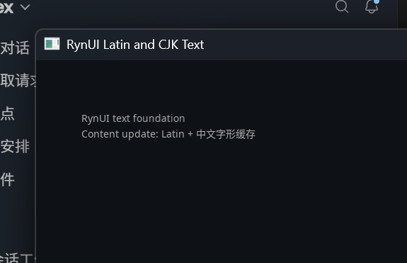

# Windows MSVC / D3D12 真实窗口证据

## 环境与执行

- Configure preset：`windows-msvc`
- Build/Test preset：`windows-msvc-debug`、`windows-msvc-release`
- Generator：`Ninja Multi-Config`
- Compiler：MSVC 19.51.36256.0
- 真实窗口命令：`out/build/windows-msvc/examples/Debug/rynui_text_demo.exe --smoke`
- GPU driver：`direct3d12`
- Shader format：`DXIL`
- Exit code：`0`

## 计数日志

Debug：

```text
gpu_driver=direct3d12 shader_format=DXIL font_rasterizations=30 font_cache_hits=0 replacement_count=0 fallback_runs=3 shape_count=2 measure_count=4 atlas_pages=1 atlas_entries=30 atlas_uploads=29 atlas_uploaded_bytes=4245 instance_count=176 instance_rebuilds=4 material_updates=1 buffer_uploads=5 glyph_draws=5 submits=5 idle_waits=187 exit_code=0
```

Release：

```text
gpu_driver=direct3d12 shader_format=DXIL font_rasterizations=30 font_cache_hits=0 replacement_count=0 fallback_runs=3 shape_count=2 measure_count=4 atlas_pages=1 atlas_entries=30 atlas_uploads=29 atlas_uploaded_bytes=4245 instance_count=176 instance_rebuilds=4 material_updates=1 buffer_uploads=5 glyph_draws=5 submits=5 idle_waits=190 exit_code=0
```

日志关系与可控 event/clock 集成测试共同证明：content 更新增加 shape 与新 glyph atlas upload；color 更新只产生 Material instance range upload；constraint 与 resize 增加 measurement/instance rebuild，但不会重新 rasterize 已缓存 glyph；完成更新后进入 idle，不持续提交空帧。

## 截图与人工核对



- 截图来自 SDL3 GPU 的 D3D12/DXIL 真实窗口，不是离屏 mock。
- 正文使用锁定的 Latin/CJK fallback fonts、14px pixel size、20px line height 和 Ant Design 6.5 dark secondary semantic color（白色 65% alpha）。
- 人工核对：Latin 与中文 glyph 均可见，baseline 连续；`中文` 等字符来自第二字体的 fallback run；12–16px 验收范围内轮廓清晰，没有 atlas seam、错页采样或 replacement glyph。
- 窗口运行期间依次触发 content、color、width constraint 与 resize 更新，并通过窗口关闭事件正常退出。
