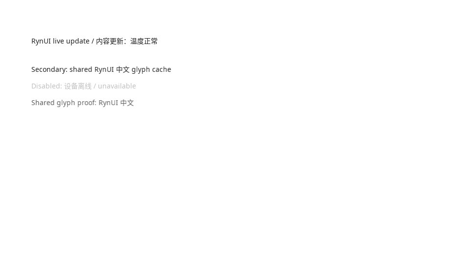

# Linux GCC / Vulkan 公开 Text 组件真实窗口证据

Change：`003-20260827-build-text-component-foundation`

## 环境与构建

- 日期：2026-08-27
- 主机：EndeavourOS Linux，kernel 7.1.8-arch1-3
- Configure：`cmake --fresh --preset linux-gcc`
- Build/Test：`linux-gcc-debug`、`linux-gcc-release`
- Generator：`Ninja Multi-Config`
- Compiler：GCC 16.2.1，`CMAKE_CXX_COMPILER=/usr/bin/g++`
- Dependency：`RYNUI_DEPENDENCY_MODE=BUNDLED`
- Font source：build tree 中锁定的 `rynui_freetype-src`、`rynui_harfbuzz-src` 和 validation fonts，不执行运行时字体扫描
- Shader：Debug/Release 示例目录均生成 `glyph.vertex.spv` 与 `glyph.fragment.spv`
- Debug/Release 完整 CTest：均为 55/55 通过

## 真实窗口运行

- 命令：`SDL_VIDEODRIVER=x11 out/build/linux-gcc/examples/Debug/rynui_text_demo --smoke`
- Window system：真实 X11 窗口
- SDL GPU driver：`gpu_driver=vulkan`
- Shader format：`shader_format=SPIR-V`
- SDL window display scale：`display_scale=2`
- 图形设备清单：Intel Arrow Lake-S Graphics（i915）与 NVIDIA GeForce RTX 5070 Ti Mobile（nvidia）；本证据只把 SDL 实际返回的 `vulkan` 作为后端结论
- Exit code：`exit_code=0`

Debug 计数：

```text
gpu_driver=vulkan shader_format=SPIR-V display_scale=2 mount_runs=1 prop_updates=4 resize_updates=1 font_rasterizations=47 font_cache_hits=0 replacement_count=0 fallback_runs=10 shape_count=5 measure_count=8 layout_count=28 atlas_pages=1 atlas_entries=47 atlas_uploads=46 atlas_uploaded_bytes=7042 instance_count=107 instance_rebuilds=5 material_updates=1 geometry_updates=8 buffer_uploads=6 glyph_draws=7 submits=7 idle_waits=205 exit_code=0
```

Release 计数：

```text
gpu_driver=vulkan shader_format=SPIR-V display_scale=2 mount_runs=1 prop_updates=4 resize_updates=1 font_rasterizations=47 font_cache_hits=0 replacement_count=0 fallback_runs=10 shape_count=5 measure_count=8 layout_count=28 atlas_pages=1 atlas_entries=47 atlas_uploads=46 atlas_uploaded_bytes=7042 instance_count=107 instance_rebuilds=5 material_updates=1 geometry_updates=8 buffer_uploads=6 glyph_draws=7 submits=7 idle_waits=207 exit_code=0
```

示例首次挂载四个公开 `ryn::Text`，随后依次触发 content、tone、width、margin 与 resize。`mount_runs=1` 证明更新没有重新执行 content closure；四个初始 Text 加一次 content 更新得到 `shape_count=5`；tone 更新只产生 `material_updates=1`；width、margin 与 resize 进入 measurement/layout/geometry 路径。`instance_count=107` 大于 `atlas_entries=47`，且 rasterization 与 atlas entry 数相同，说明重复 Latin/CJK glyph 共享 atlas。受控 event/clock 测试进一步证明每类更新提交一次必要帧，相等写入不请求帧，稳定后只增加 `idle_waits`。

## 截图与人工核对



- 截图由运行中的 SDL3/X11 真实窗口直接捕获，不是 headless 或离屏 mock。
- Default Theme 使用 Ant Design 6.5.0 基线的 14 logical-pixel 常规正文、22 logical-pixel line height，以及 primary、secondary、disabled 三种语义 tone。
- 截图捕获于 content、tone、width、margin 与 resize 更新完成后；第一、第二行显示 primary，第三行显示 disabled，第四行保留 secondary。
- 人工核对 Latin/CJK 均清晰可见，行间顺序稳定，无 replacement glyph、atlas seam、裁剪错位或明显基线跳变。

## Clang Debug

- Configure/Build/Test：`linux-clang`、`linux-clang-debug`
- Compiler：Clang 22.1.8，`CMAKE_CXX_COMPILER=/usr/bin/clang++`
- RynUI 自有 target 的 Ninja 规则包含 `-std=c++20 -Wall -Wextra -Wpedantic`，未出现 `-std=gnu++20`
- 完整 CTest：55/55 通过

因此任务 7.2 已完成；Clang 构建证据不替代本节的 GCC/Vulkan/SPIR-V 真实窗口证据，也不外推为 Windows 验收。
