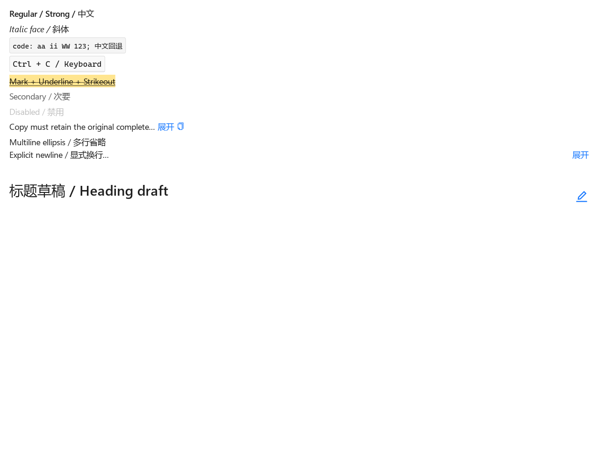
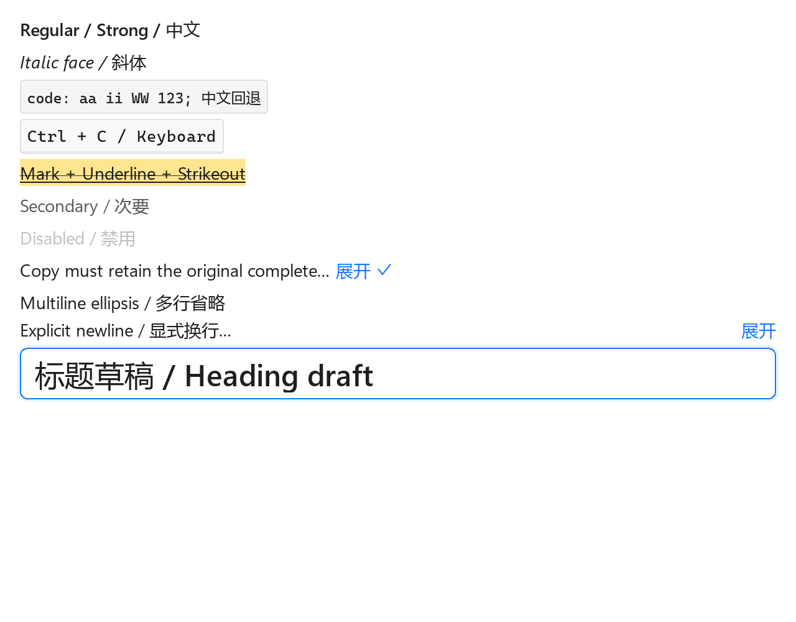
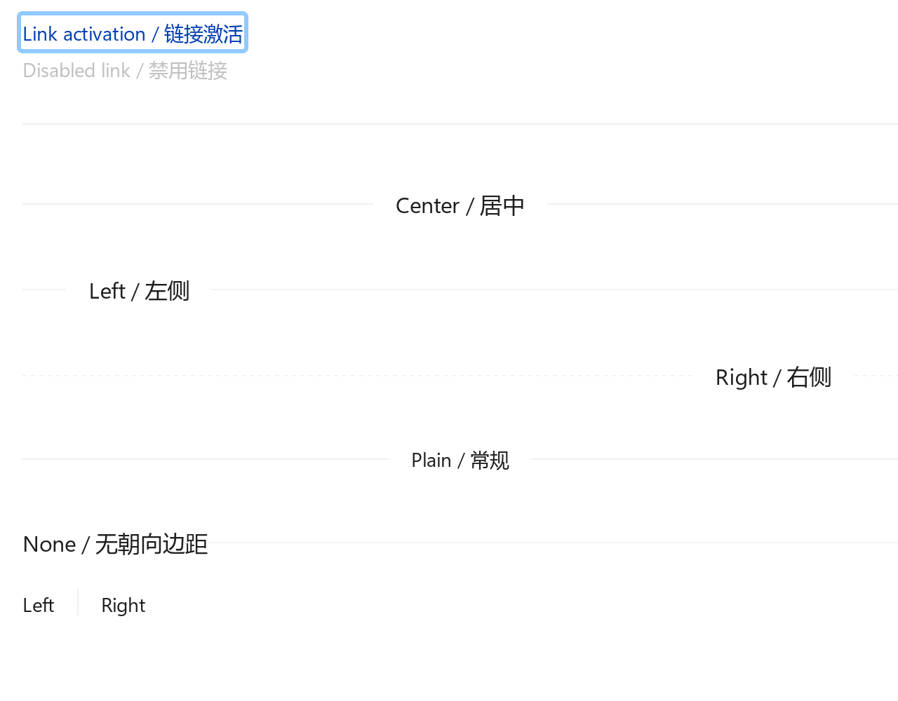
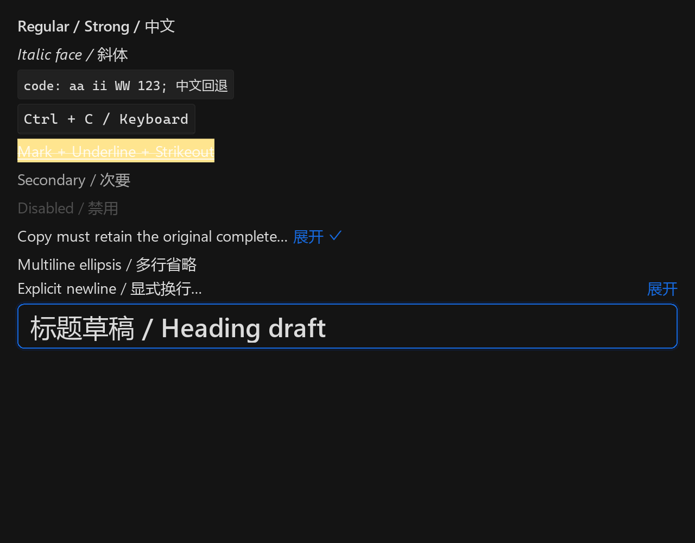

# Windows Typography / Divider 验收

status: passed  
scope: windows-native  
日期：2026-10-02。环境：Windows 11 专业工作站版 10.0.26300，MSVC x64 14.51.36231，`windows-msvc`，Ninja Multi-Config，D3D12 / DXIL。

## 构建与原生窗口

通过 `VsDevCmd.bat -arch=x64 -host_arch=x64` 执行 `cmake --fresh --preset windows-msvc`，随后完整 Debug 和 Release build 均退出 0。验收源码增加动画时钟推进后，两个配置的增量构建均通过。一次 Release 链接遇到可执行文件占用，窗口退出后重试成功；这不是源码编译错误。

`rynui_token_gallery --smoke` 在真实 Win32 窗口使用 D3D12/DXIL，退出 0；`live_samples=57`、`component_entries=73`。专门的 `--typography-acceptance` 模式在同一原生程序中分三页检查五级标题、正文语义/编辑及 Link/Divider，通过 GPU readback 保存 1280×1000 截图。每次截图推进布局、动画及两次真实 GPU 提交。

系统 display scale 实测 **1.25**。下面的 1.0/1.25/1.5/2.0 是 **acceptance render scale**，不声称修改了 Windows 系统缩放设置。所有九次运行均退出 0、`typography_acceptance=passed`；日志、字体、计数、可执行文件 SHA256 与 79 张 PNG 的 SHA256 保存在 [windows-typography.json](windows-typography.json)。

| 运行 | 配置 | render scale | theme | Input host | submits |
| --- | --- | --- | --- | --- | --- |
| scale-1.0 | Debug | 1.0 | light | 有 | 18 |
| scale-1.25 | Debug | 1.25 | light | 有 | 18 |
| scale-1.5 | Debug | 1.5 | light | 有 | 18 |
| scale-2.0 | Debug | 2.0 | light | 有 | 18 |
| dark-1.0 | Debug | 1.0 | dark | 有 | 18 |
| dark-2.0 | Debug | 2.0 | dark | 有 | 18 |
| system-scale | Debug | 1.25 | light | 有 | 18 |
| copy-only | Debug | 1.25 | light | **无** | 14 |
| release | Release | 1.25 | light | 有 | 18 |

系统 GPU inventory：NVIDIA GeForce RTX 5070 Ti Laptop GPU，驱动 32.0.16.1074（2026-07-02）；Intel Graphics，驱动 32.0.101.8724（2026-04-16）。当前渲染 telemetry 确认 D3D12，未暴露具体 adapter 名称；此 inventory 不代表已经证明选择了其中哪张 GPU。

## 字体与视觉检查

实际 face：regular `Segoe UI Variable Text / SEGUIVAR.TTF / index 0 / 400`；strong `Segoe UI / SEGUISB.TTF / index 0 / 600`；italic `Segoe UI / SEGOEUII.TTF / index 0 / 400 / italic`；monospace `Cascadia Mono / CASCADIAMONO.TTF`。UI 缺字链包含 Microsoft YaHei UI，code/kbd 的中文由 UI 链回退。500 字重没有可表达的独立静态 face，明确记录 regular fallback；不把该 fallback 宣称为真实 500 字重。

核对四档缩放的标题层级、code/kbd 背景与边框、mark/underline/strikethrough、单/多行省略、展开、复制成功 Check 图标、标题编辑字体与焦点边框、Link 焦点和 Divider 各形式：文字、装饰和边框保持对齐，超宽内容裁切，未出现重叠或缺失的操作入口。对应截图全部纳入 JSON 文件/hash 合同。






## 系统剪贴板、编辑与交互

原生窗口中通过相同的 FocusManager、PointerRouter 和 TextInput 派发规范化事件。复制读取真实 Windows 剪贴板并逐字比较原始全文；纯 Typography 窗口明确断言没有 Input host、text_edit 和 input_runtime。成功后显示 Check，结束时恢复先前的文本剪贴板。

编辑激活真实 Input 和 SDL 系统文本输入 session；先派发 composition，再验证第一次 Esc 只取消组合、第二次 Esc 取消编辑并关闭 session。重新编辑后选中全文、提交中英文草稿、Enter 触发受控 onEdit 回写；保持 H3 字体度量。Link 的键盘与指针各激活一次，disabled Link 不 eligible，截图包含键盘焦点外观。

这里的 IME 证据是原生 session 生命周期与规范化组合事件；没有把它描述成物理键盘输入或系统候选窗的人工验收。Linux 原生 Wayland 未运行，Linux checklist 保持未勾选。

## Windows 相关检查

`rynui.default_font_chain`、`icon_asset_contract`、`windows_libdecor_isolation`、`python_cache_clean`、`generated_shaders`、`deployed_shaders`、`dependency_lock`、`typography_windows_evidence`：**8/8 通过**。锁与许可证 inventory 合同通过；本阶段未增加未锁定第三方依赖。

新增 evidence contract 校验平台、MSVC preset、Debug/Release 构建结果、真实 D3D12/DXIL、系统/四档 render scale、无 Input 复制、交互结果、独立 styled font 文件以及每张 PNG/hash；self-test 拒绝 headless、跨 scope、错误 scale、伪装 copy-only、共用 regular face 和缺失截图。`git diff --check` 通过。

复跑示例：

```powershell
./out/build/windows-msvc/examples/Debug/rynui_token_gallery.exe --typography-acceptance --acceptance-scale=2.0 --evidence-dir=out/typography-native/scale-2.0
./out/build/windows-msvc/examples/Debug/rynui_token_gallery.exe --typography-acceptance --copy-only --evidence-dir=out/typography-native/copy-only
ctest --preset windows-msvc-debug -R typography_windows_evidence --output-on-failure
```
