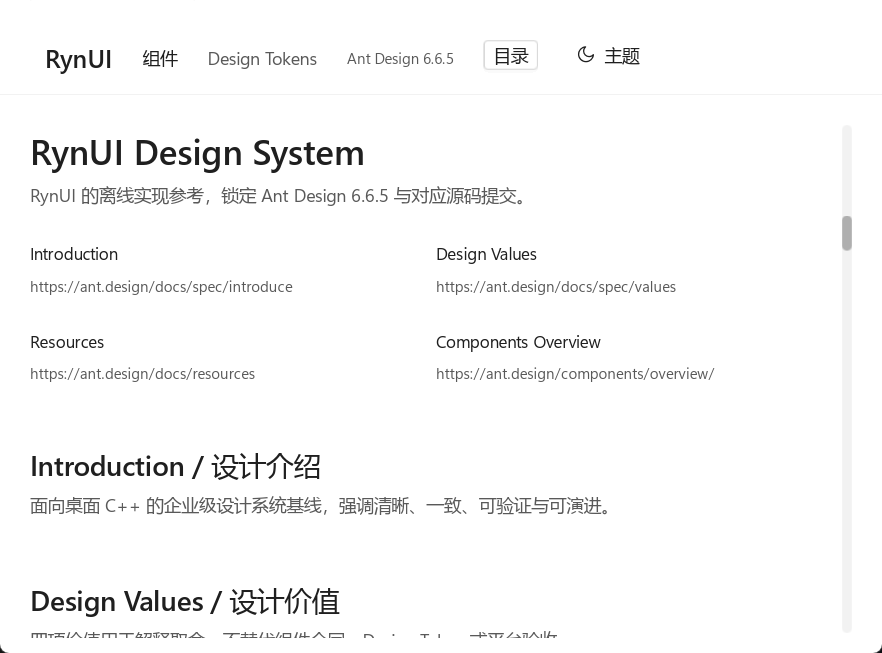

# Windows 原生验收

status: passed  
scope: windows-native  
日期：2026-10-02。Windows 11 专业工作站版 10.0.26300，MSVC x64 14.51.36231，`windows-msvc`，Ninja Multi-Config。Debug/Release build 均退出 0；日志 `out/035-final-native-debug-build.log`、`out/035-native-release-build.log`。

两配置各运行三次真实 SDL 窗口：Gallery smoke + Win32 resize，Typography 系统 render scale，Typography 2.0 render scale。共 **6 次 exit 0**；D3D12/DXIL。每次字体/输入验收 18 submits，clipboard、ellipsis、edit、link、divider passed，系统 display scale 实测 1.25。2.0 是 acceptance render scale，不声称修改系统 DPI。

Win32 `SetWindowPos` 在窗口活动期间依次调整 outer size 为 1200×840、900×700。实测 client 分别为 1182×793、882×653；窗口继续布局/呈现并以 exit 0 结束。四张屏幕截图核对了字体、viewport、滚动条和内容裁切，另通过 SDL GPU readback 保存字体/编辑/分割线截图。原生截图与 bytes 数据测试是独立证据。

字体：Segoe UI Variable Text regular、Segoe UI semibold、Segoe UI italic、Cascadia Mono；中文由系统 UI fallback 支持。500 字重仍为可诊断 regular fallback。IME 证据包括真实 SDL text-input session 生命周期与归一化 composition/commit；未宣称人工候选窗或物理键盘输入验收。

GPU inventory 实测 NVIDIA GeForce RTX 5070 Ti Laptop GPU（32.0.16.1074）、Intel Graphics（32.0.101.8724）。运行 telemetry 只证明 direct3d12，没有暴露具体 adapter，不能以 inventory 推断实际选卡。

`windows/runs.json` 保存六次运行的结果、日志、exe SHA256 和 **40 张 PNG** 的 SHA256；原始日志同时保存在 windows/。重复运行脚本为 `windows/validate_native.py`，需 Python + Pillow，工作目录为仓库 root，先完成 Debug/Release build。截图实际检查包括 Debug 两档 resize、Release 2.0 的编辑字体/焦点边框与分割线。

Linux 原生没有对应实际机器运行结果，任务 7.1 保持 pending。共同 HEADLESS/Recording 结果不能代替 Linux 窗口/GPU/系统服务验收。

Release 的系统字体、Windows libdecor 隔离、platform/frame 生命周期、生成/部署 shader 检查 **6/6** 通过，日志 windows/release-checks.txt。最终 doctor healthy、全量 strict **35/35**、`git diff --check` 通过，六次 native 结果及 40 个 PNG SHA256 校验通过。
